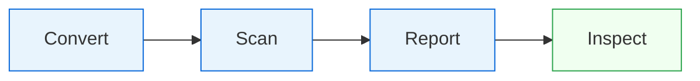
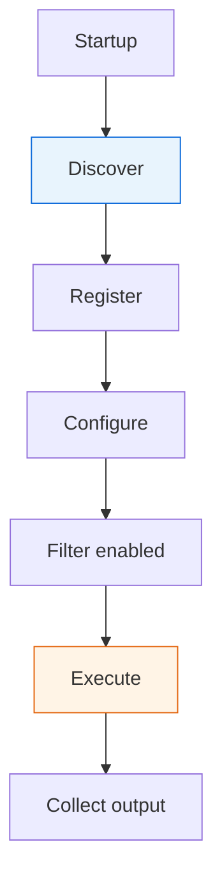
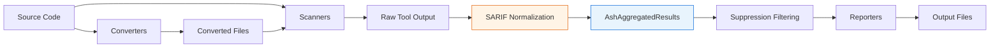

# Architecture

This page explains how ASH is put together — the execution model, how plugins are discovered and run, and how findings move through the system. For the domain vocabulary (finding, scanner, reporter, suppression), see [Core Concepts](concepts.md).

## Overview

ASH is a plugin-based security scanning orchestrator. It does not itself analyze code — it drives a collection of third-party scanners (Bandit, Semgrep, Checkov, Grype, cfn-nag, and others), normalizes their heterogeneous output into SARIF, and hands the aggregated results to a pluggable set of reporters.

Three design choices shape the rest of the system:

- **SARIF as the internal interchange format.** Every scanner's output is converted to SARIF before anything else touches it. Suppressions, metrics, and reporters all operate on SARIF.
- **Phases as the top-level control flow.** Execution is a fixed sequence of phases. Each phase has one job and a stable interface.
- **Everything non-core is a plugin.** Scanners, converters, and reporters are all plugins discovered at startup and registered with a central manager.

## Execution Phases

A scan runs four phases in order:



Each phase is a class inheriting from `EnginePhase` (see `automated_security_helper/core/phases/`):

- **Convert** (`convert_phase.py`) — transforms input files into formats scanners can read. Jupyter notebooks become Python, archives are extracted, Helm charts are rendered.
- **Scan** (`scan_phase.py`) — runs every enabled scanner against the source and converted directories, collecting SARIF from each.
- **Report** (`report_phase.py`) — hands the aggregated results to every enabled reporter, which writes output files in its requested format.
- **Inspect** (`inspect_phase.py`) — launches the interactive TUI for reviewing findings. Optional; skipped in non-interactive runs.

Phases can be run selectively via the `--phases` flag. The scan can also be resumed from existing results by running `report` or `inspect` alone against a prior output directory.

The `ScanExecutionEngine` in `core/execution_engine.py` owns the sequence. It constructs each phase, wires in the `PluginContext` (shared state including paths, config, and logger), and runs them serially.

## Plugin Lifecycle

Scanners, converters, and reporters all follow the same lifecycle:



1. **Discover.** On startup, `discover_plugins()` walks the Python module path looking for packages in the `ash_plugins` namespace. Any package exporting `ASH_SCANNERS`, `ASH_CONVERTERS`, or `ASH_REPORTERS` contributes its classes. Built-in plugins are loaded the same way.
2. **Register.** The `@ash_scanner_plugin`, `@ash_converter_plugin`, and `@ash_reporter_plugin` decorators register classes with the central `ash_plugin_manager`.
3. **Configure.** When a phase starts, each plugin class is instantiated with its config drawn from the resolved `AshConfig`. The config is looked up by plugin type and lowercased class name.
4. **Filter.** A plugin is skipped if `config.enabled` is `False`, if `--python-based-plugins-only` is set and the plugin isn't Python-only, or if CLI flags (`--scanners`, `--exclude-scanners`) exclude it.
5. **Execute.** Enabled scanners run in parallel via a `ThreadPoolExecutor` (default) or sequentially if `--strategy sequential`. Each scanner returns SARIF, which the phase merges into the aggregated results.
6. **Collect.** Plugin status (succeeded, failed, skipped, disabled) is recorded on the aggregated results so reporters can surface coverage gaps.

Custom plugins follow the same rules. Point ASH at your package with `--ash-plugin-modules my_ash_plugins` and your classes will be discovered and treated the same as built-ins.

## Data Flow



Each scanner wraps an external tool, invokes it against the target, parses the tool's native output (JSON, XML, or custom text), and converts it into SARIF. The SARIF documents from all scanners are merged into a single `AshAggregatedResults` object (defined in `models/asharp_model.py`).

Suppressions are applied as a filtering pass over the SARIF runs, not at scanner level. This is why inline suppressions and config-based suppressions produce identical results — both end up as `Kind1.inSource` entries in the final SARIF, distinguished only by their justification prefix.

Reporters receive the aggregated results and write to the output directory. Because every reporter reads the same SARIF, adding a new output format means writing a reporter — you never touch the scanners.

## SARIF as the Canonical Format

SARIF (Static Analysis Results Interchange Format, OASIS standard) is the internal data model for every finding. Concretely:

- Every scanner produces SARIF, either natively or via a conversion step inside the scanner plugin.
- Suppression rules match against SARIF properties (rule ID, file path, line range).
- Metrics — severity counts, scanner-by-scanner statistics, the metrics table — are computed from SARIF.
- Reporters consume SARIF and transform it into their output format (HTML, CSV, CycloneDX, OCSF, Security Hub events).

The tradeoff is that SARIF is verbose and not every tool maps cleanly onto it (Grype's CycloneDX-first model is a notable example). The upside is that adding a scanner doesn't force any other component to change, and adding a reporter automatically gets you every scanner's findings.

## Configuration Resolution

Configuration is resolved at the start of every run. `resolve_config()` in `config/resolve_config.py` performs the following, in order:

1. **Start with the default config** from `default_config.py` — all built-in scanners and reporters enabled, conservative ignore paths.
2. **Find a config file** by checking the following names in the source directory and `.ash/` subdirectory:

   ```
   .ash.yml      .ash.yaml      .ash.json
   ash.yml       ash.yaml       ash.json
   ```

   The first match wins. If `--config` is passed explicitly, that file is used directly and no search happens.
3. **Merge the config file over the defaults.** Values in the file replace defaults; lists replace (not append to) defaults unless the file uses the `+=` append syntax.
4. **Apply CLI overrides.** `--config-overrides` values are applied last and win over both the default and the file. They use dot-path syntax:

   ```bash
   ash --config-overrides 'scanners.bandit.enabled=false'
   ash --config-overrides 'global_settings.ignore_paths+=[{"path": "build/"}]'
   ```
5. **Validate.** The merged dict is parsed into an `AshConfig` pydantic model. Unknown fields, wrong types, or invalid values raise an error before any scanner runs.

The resolved `AshConfig` is attached to the `PluginContext` and passed to every phase and plugin, so runtime behavior is fully determined before the first scanner starts.
