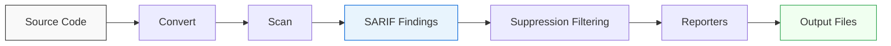

# Core Concepts

This page explains the domain model behind ASH — the key abstractions and how they fit together.

## Finding

A finding is a single security issue detected by a scanner. Each finding has a rule ID, severity level, source location (file and line), and a message describing the problem. Internally, ASH represents all findings in SARIF format regardless of which scanner produced them.

## Scanner

A scanner is a plugin that analyzes source code, configuration files, or container images for a specific class of vulnerabilities. Each scanner wraps an external tool (like Bandit, Checkov, or Grype), invokes it against the target, and translates its output into SARIF findings. ASH ships with built-in scanners and supports community-contributed ones.

## Converter

A converter transforms input files into a format that scanners can process. For example, a converter might extract files from a ZIP archive, convert Jupyter notebooks to Python scripts, or render Helm charts into Kubernetes manifests. Converters run before scanners in the pipeline.

## Reporter

A reporter takes the aggregated SARIF findings and produces output in a specific format. Built-in reporters generate HTML dashboards, CSV spreadsheets, SARIF files, CycloneDX SBOMs, and OCSF events. AWS reporters can push findings to Security Hub, CloudWatch Logs, or S3.

## Suppression

A suppression is a rule that hides a known-accepted finding from results. Suppressions can be config-based (defined in `.ash-config.yml` by rule ID, file path, or pattern) or inline (a code comment like `# ash-ignore:rule-id` placed next to the flagged line). Suppressed findings are still recorded but marked as suppressed in the output.

## Phases

ASH processes code in four sequential phases:

1. **Convert** — transform input files into scannable formats
2. **Scan** — run all enabled scanners against the (converted) source
3. **Report** — generate output files from the collected findings
4. **Inspect** — launch an interactive UI for reviewing results (optional)

## Modes

ASH supports three execution modes:

- **Local** — runs scanners directly on the host using UV-managed tool installations
- **Container** — runs inside a Docker container with all tools pre-installed
- **Pre-commit** — runs as a Git pre-commit hook, scanning only staged files

## SARIF

SARIF (Static Analysis Results Interchange Format) is the internal data model. Every scanner produces SARIF output, every suppression rule matches against SARIF properties, and every reporter consumes SARIF as input. This common format lets ASH treat all scanners uniformly regardless of their native output format.

## Data Flow

The following diagram shows how findings flow through the system:

Source code enters the pipeline, converters prepare it, scanners produce SARIF findings, suppression rules filter out accepted issues, and reporters write the final output in the requested formats.
