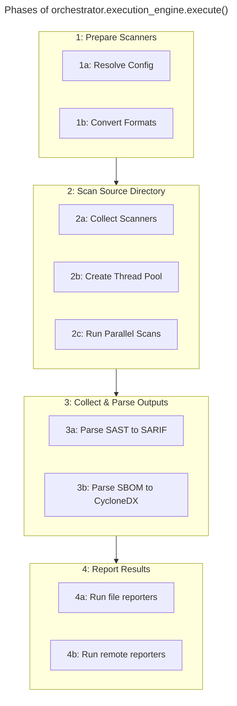

# ASH Orchestrator Workflow

- [Phase Overview](#phase-overview)
  - [1. Prepare scanners](#1-prepare-scanners)
  - [2. Scan source directory](#2-scan-source-directory)
  - [3. Collect and parse scanner outputs](#3-collect-and-parse-scanner-outputs)
  - [4. Report results where needed](#4-report-results-where-needed)
- [Deep Dive](#deep-dive)
  - [`ASHScanOrchestrator`](#ashscanorchestrator)
  - [`ScanExecutionEngine`](#scanexecutionengine)
  - [`ScannerFactory`](#scannerfactory)

## Phase Overview

ASH security scan orchestration is comprised of 4 distinct phases focused on a set of specific tasks across each phase.



### 1. Prepare scanners

1. Resolve configuration
2. Convert any unscannable formats into scannable ones
    - Jupyter notebooks to Python
    - Zip/Tar/etc archive content extraction

### 2. Scan source directory

1. Collect the set of scanners and scan paths based on the build-time default configuration merged with the user's configuration (if present)
2. Create a thread pool, registering each scanner instance into it
3. Invoke threads in parallel to start scanners

### 3. Collect and parse scanner outputs

1. Scanner outputs are collected once scanners are complete
  - Vulnerability/SAST scanner outputs are parsed into SARIF format, if not already
  - SBOM scanner outputs are parsed into CycloneDX format, if not already

### 4. Report results where needed

1. File-based reporters such as Text, HTML, JUnitXML, JSON, SARIF, etc
2. Remote reporters such as Amazon Security Hub or custom API endpoints

## Deep Dive

### `ASHScanOrchestrator`

Whether invoking via CLI script or from Python directly, the ASH scan entrypoint involves instantiating an `ASHScanOrchestrator` instance.

Sample from Python:

```py
orchestrator = ASHScanOrchestrator(
    source_dir=Path(source_dir),
    output_dir=Path(output_dir),
    config_path=Path("ash.yaml"),
    scan_output_formats=[
        ExportFormat.JSON,
        ExportFormat.SARIF,
        ExportFormat.CYCLONEDX
        ExportFormat.HTML,
        ExportFormat.JUNITXML,
    ],
)
```

Same sample as CLI:

```sh
ash --source-dir "." --output-dir "./ash_output" --config-path "./ash.yaml" --scan-output-formats json,sarif,cyclonedx,html,junitxml
```


### `ScanExecutionEngine`


### `ScannerFactory`
