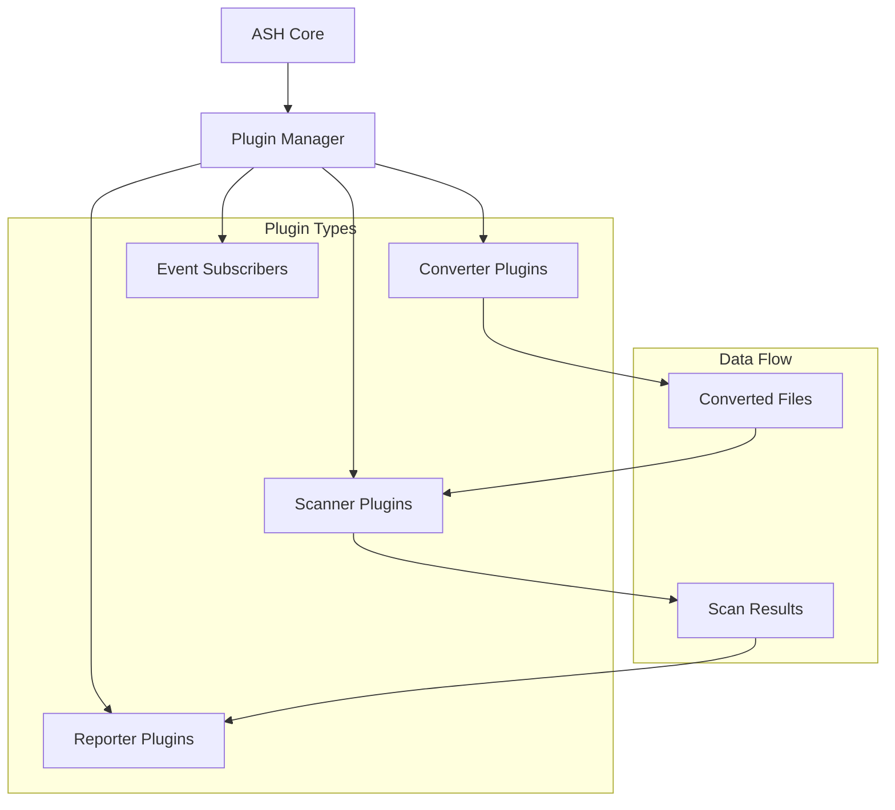
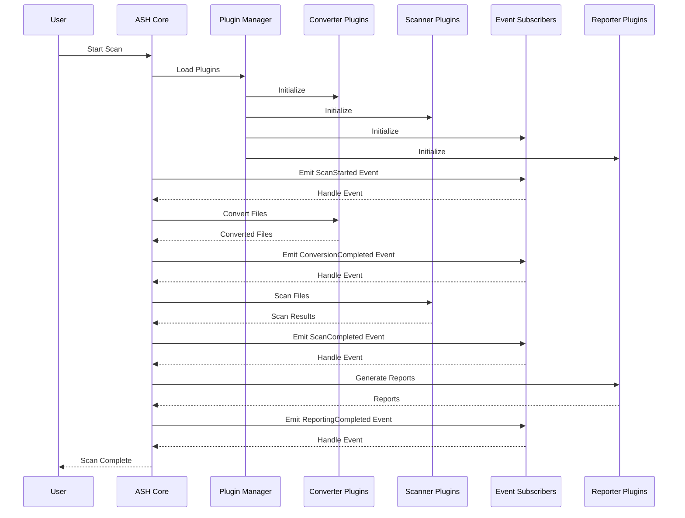
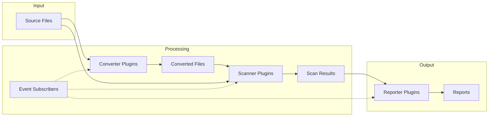
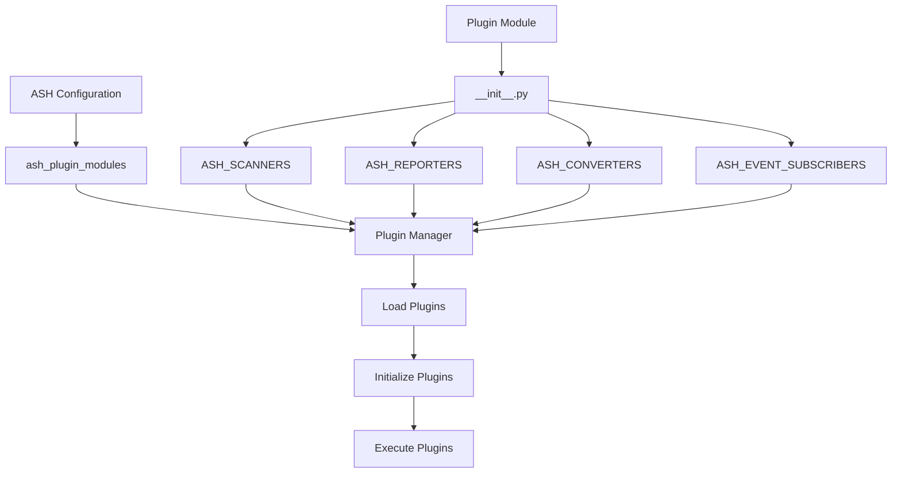
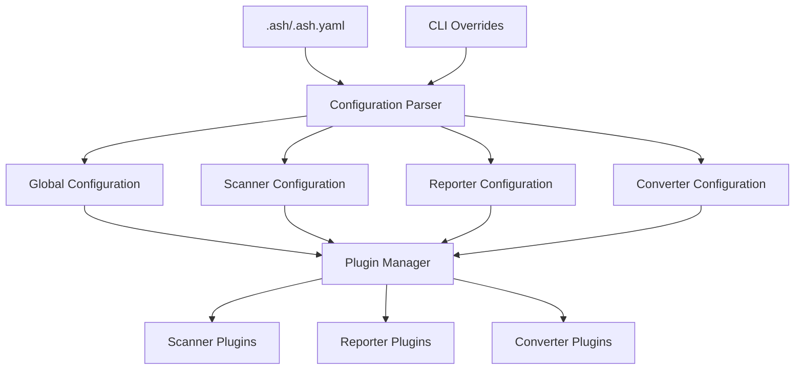
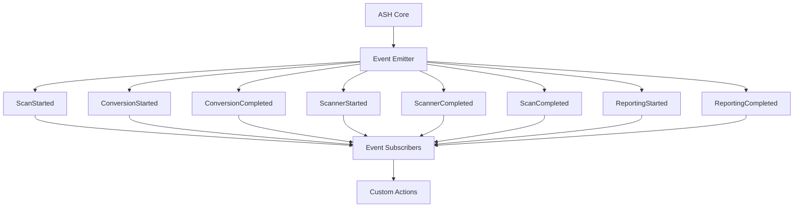

# ASH Plugin Architecture

This document provides visual diagrams of the ASH plugin architecture, workflows, and relationships.

> For more detailed diagrams specific to each plugin type, see:
> - [Scanner Plugin Diagrams](scanner-plugins-diagrams.md)
> - [Reporter Plugin Diagrams](reporter-plugins-diagrams.md)
> - [Converter Plugin Diagrams](converter-plugins-diagrams.md)
> - [Event Subscriber Diagrams](event-subscribers-diagrams.md)

## Plugin Architecture Overview

The following diagram shows the high-level architecture of the ASH plugin system:

## Plugin Lifecycle

The following diagram shows the lifecycle of plugins during an ASH scan:

## Data Flow Between Plugins

The following diagram shows the data flow between different types of plugins:

## Plugin Registration and Discovery

The following diagram shows how plugins are registered and discovered:

## Plugin Configuration Flow

The following diagram shows how plugin configuration flows through the system:

## Event System

The following diagram shows the event system in ASH:

