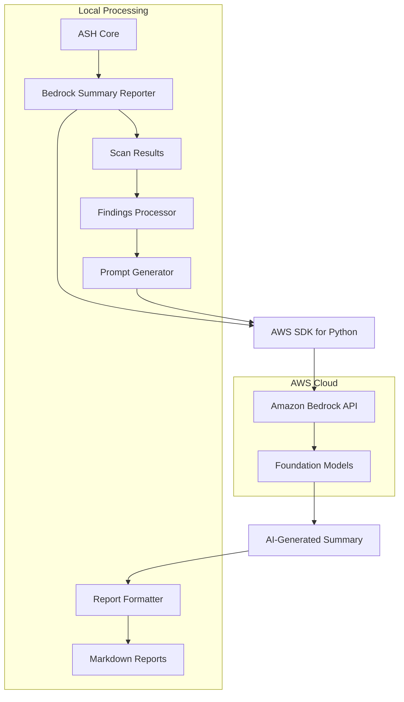
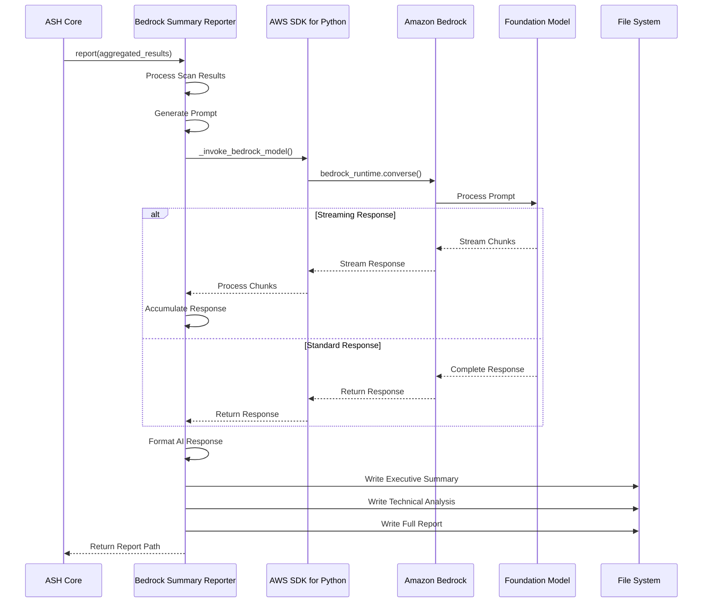
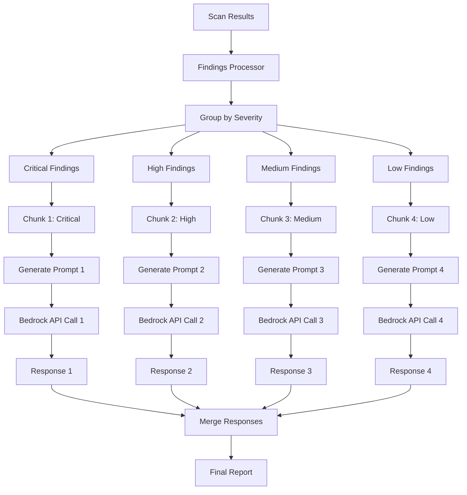
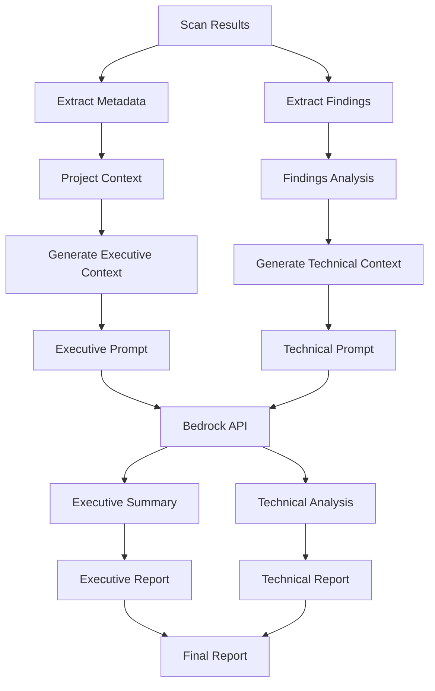
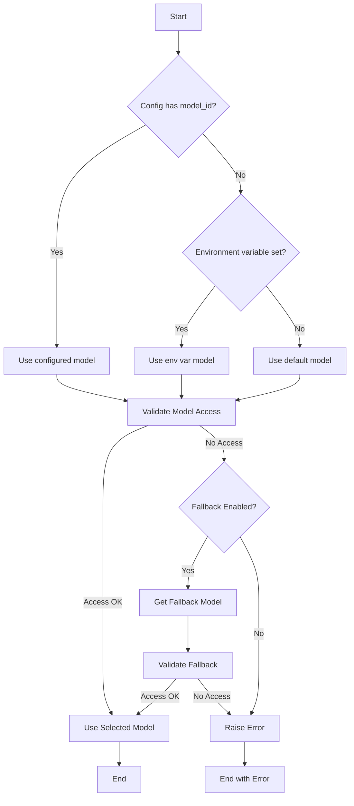
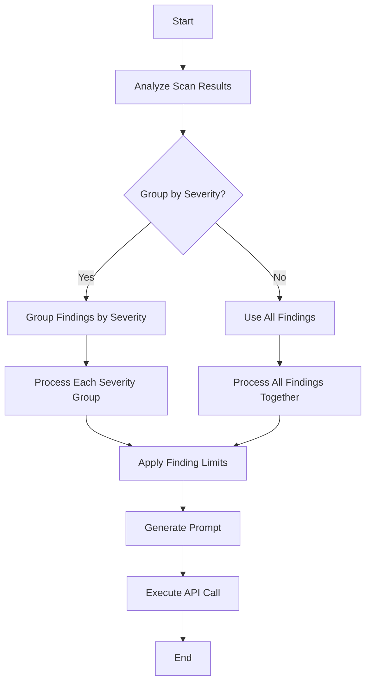
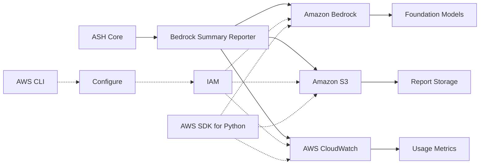
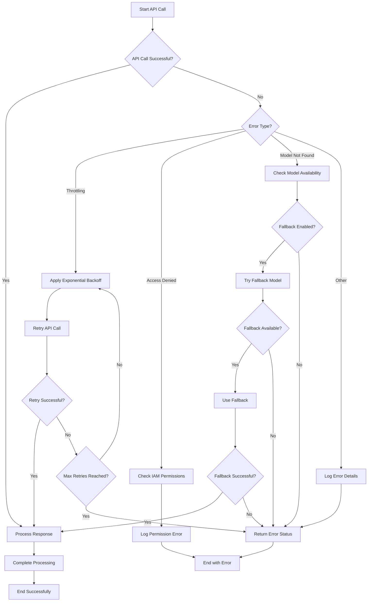
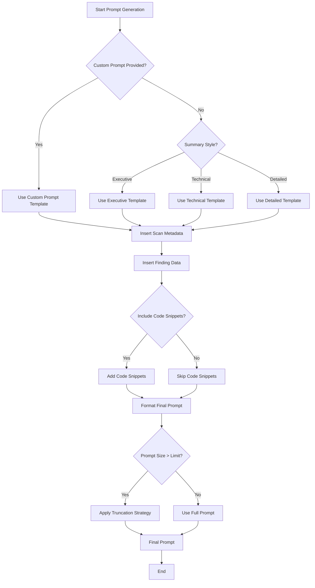

# Bedrock Summary Reporter Diagrams

This document provides visual diagrams of the ASH Bedrock Summary Reporter architecture and workflows using Mermaid.

## Architecture Overview

The following diagram shows the high-level architecture of the Bedrock Summary Reporter:

## Sequence Diagram

The following diagram shows the sequence of operations in the Bedrock Summary Reporter:

## Chunking and Processing Flow

The following diagram shows how the Bedrock Summary Reporter processes large scan results in chunks:

## Report Generation Process

The following diagram shows the report generation process:

## Model Selection Logic

The following diagram shows the model selection logic with fallback support:

## Cost Optimization Strategy

The following diagram shows the cost optimization strategy:

## Integration with AWS Services

The following diagram shows how the Bedrock Summary Reporter integrates with other AWS services:

## Error Handling Flow

The following diagram shows the error handling flow with retry logic and fallback models:

## Custom Prompt Flow

The following diagram shows the custom prompt generation flow:

