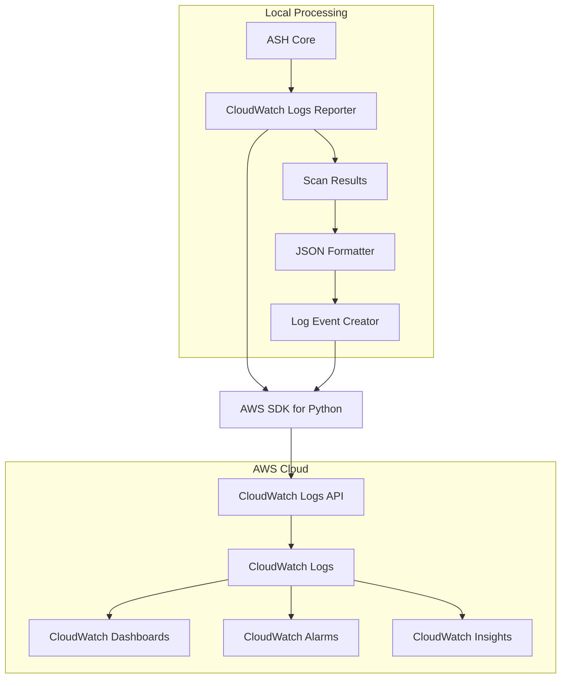
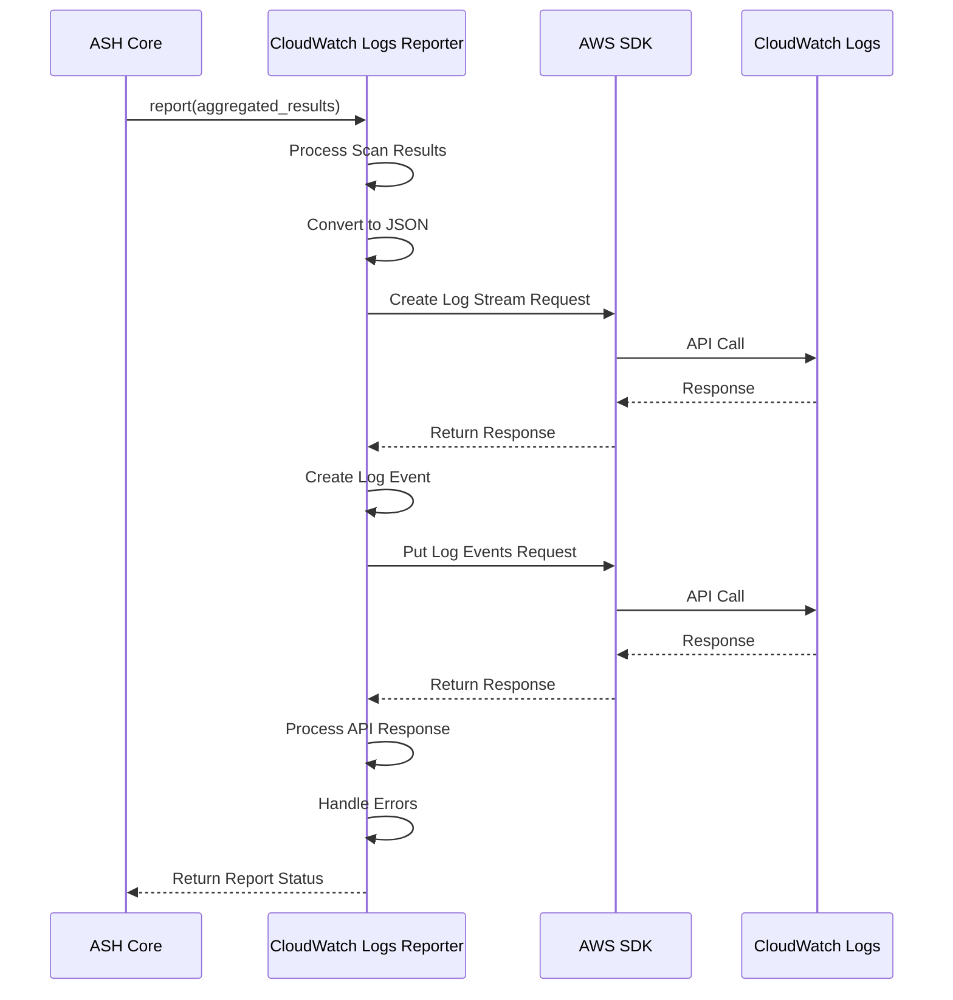
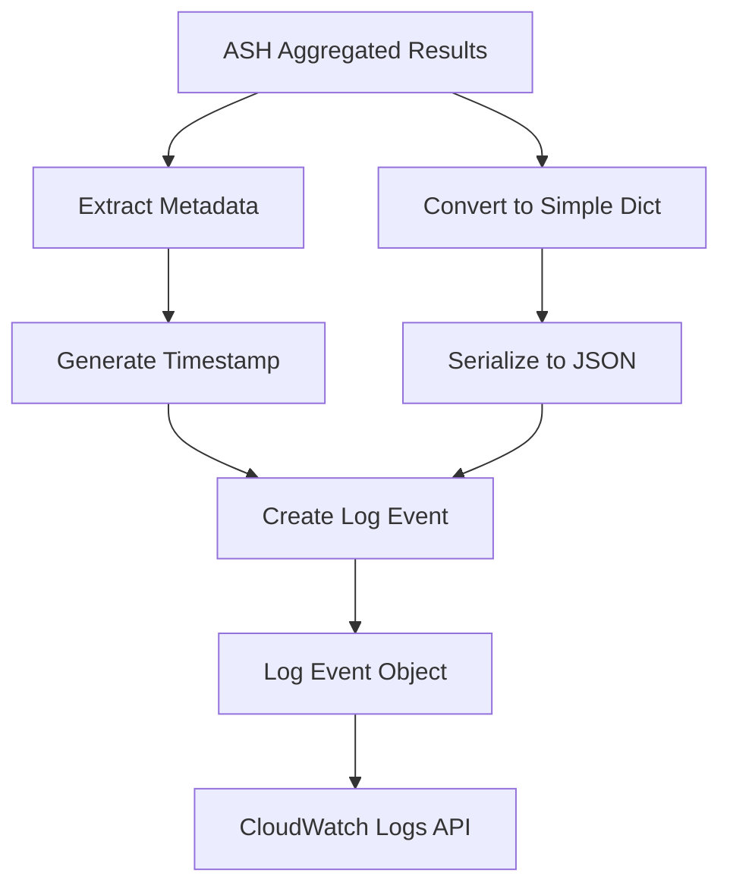
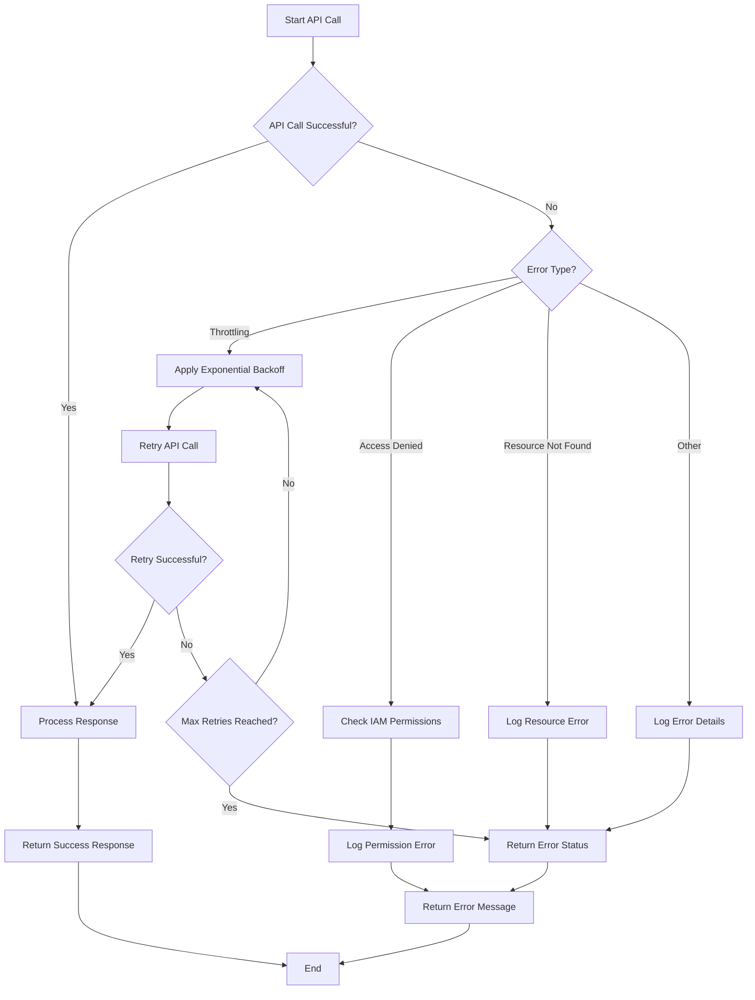
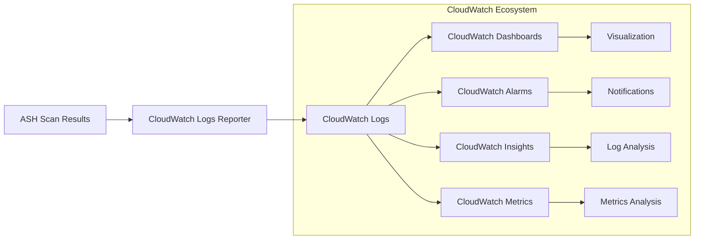
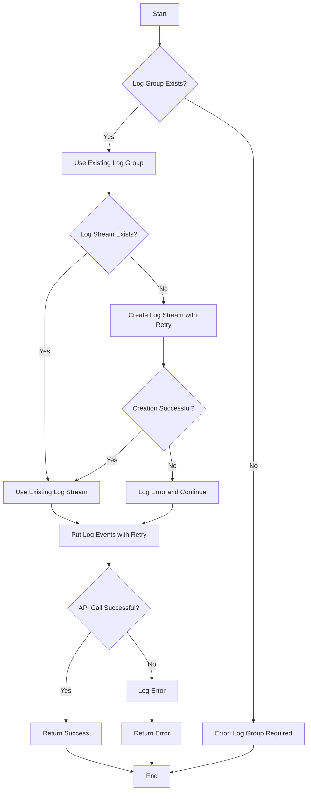
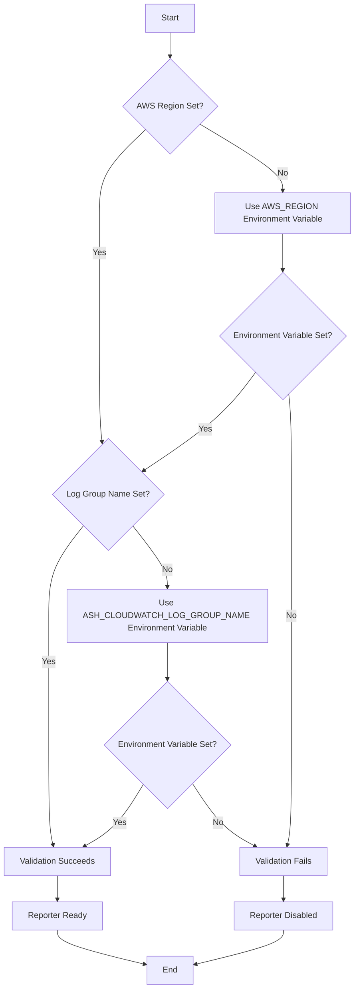

# CloudWatch Logs Reporter Diagrams

This document provides visual diagrams of the ASH CloudWatch Logs Reporter architecture and workflows using Mermaid.

## Architecture Overview

The following diagram shows the high-level architecture of the CloudWatch Logs Reporter:

## Sequence Diagram

The following diagram shows the sequence of operations in the CloudWatch Logs Reporter:

## Log Event Creation Process

The following diagram shows the log event creation process:

## Error Handling Flow

The following diagram shows the error handling flow with retry logic:

> **Note**: The implementation now includes retry logic with exponential backoff, improving the reliability of the CloudWatch Logs Reporter.

## Integration with CloudWatch Services

The following diagram shows how the CloudWatch Logs Reporter integrates with other CloudWatch services:

## Log Group and Stream Management

The following diagram shows the log group and stream management process:

## Configuration Flow

The following diagram shows the configuration flow:

