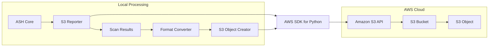
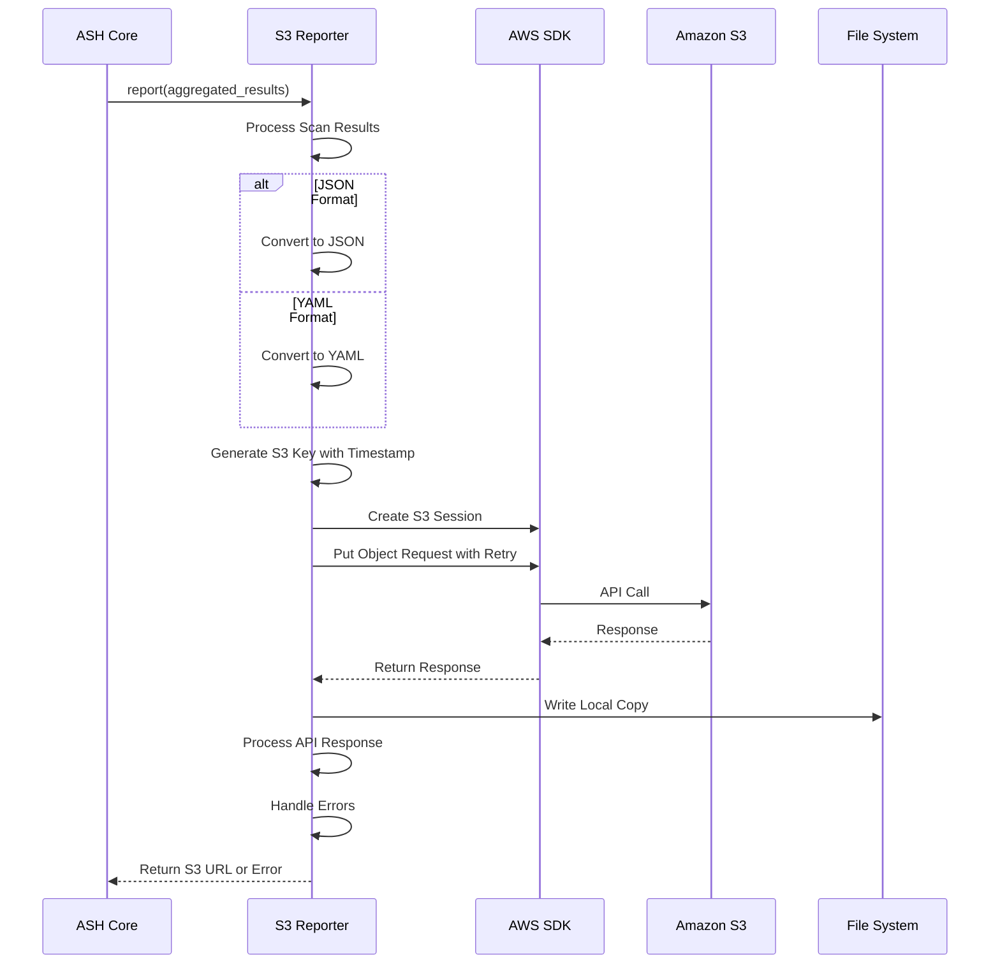
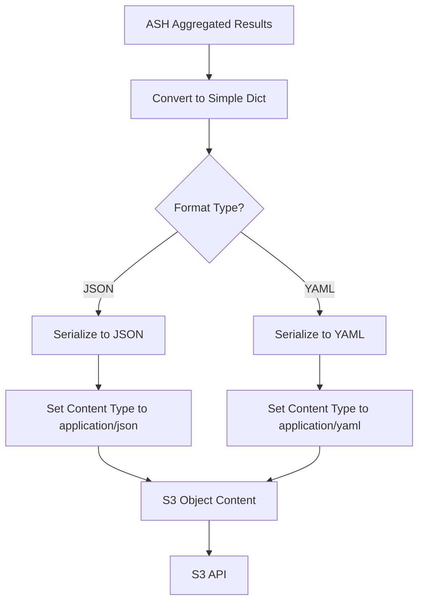
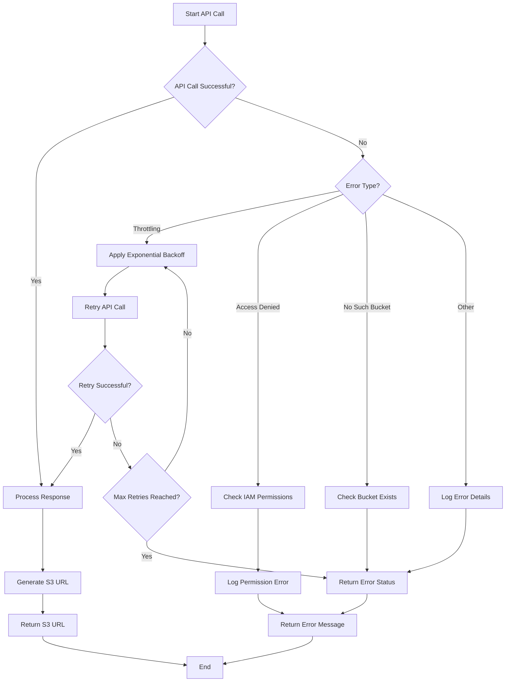
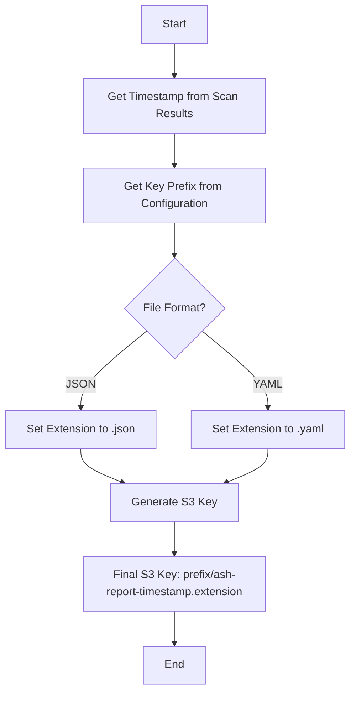
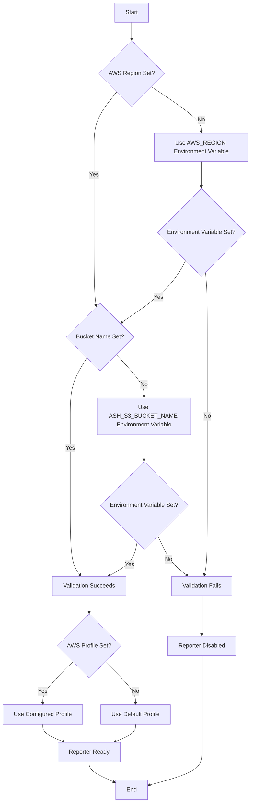
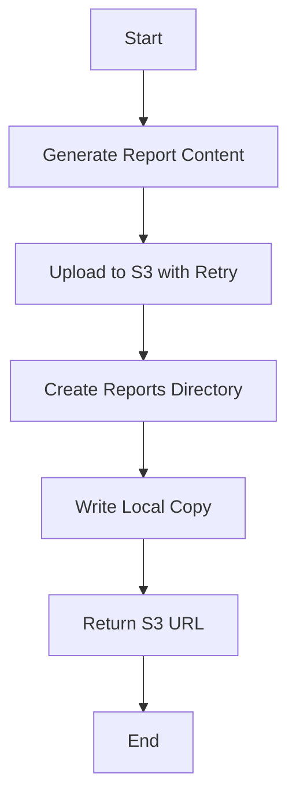
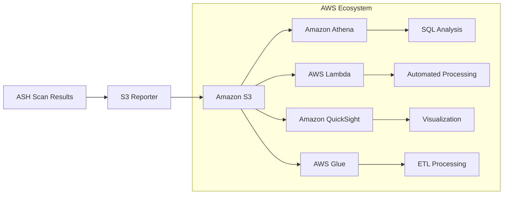

# S3 Reporter Diagrams

This document provides visual diagrams of the ASH S3 Reporter architecture and workflows using Mermaid.

## Architecture Overview

The following diagram shows the high-level architecture of the S3 Reporter:

## Sequence Diagram

The following diagram shows the sequence of operations in the S3 Reporter:

## Format Conversion Process

The following diagram shows the format conversion process:

## Error Handling Flow

The following diagram shows the error handling flow with retry logic:

> **Note**: The implementation now includes retry logic with exponential backoff, improving the reliability of the S3 Reporter.

## S3 Object Naming and Organization

The following diagram shows the S3 object naming and organization process:

## Configuration Flow

The following diagram shows the configuration flow:

## Local File Output

The following diagram shows the local file output process:

## Integration with Other AWS Services

The following diagram shows how the S3 Reporter can integrate with other AWS services:

