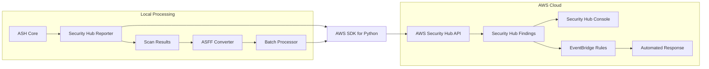
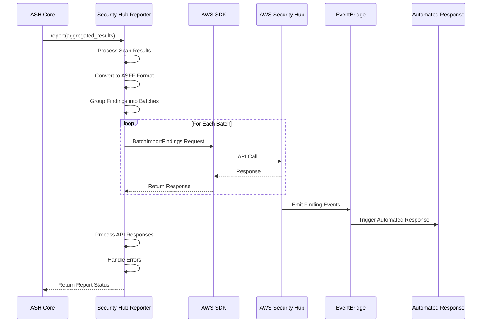
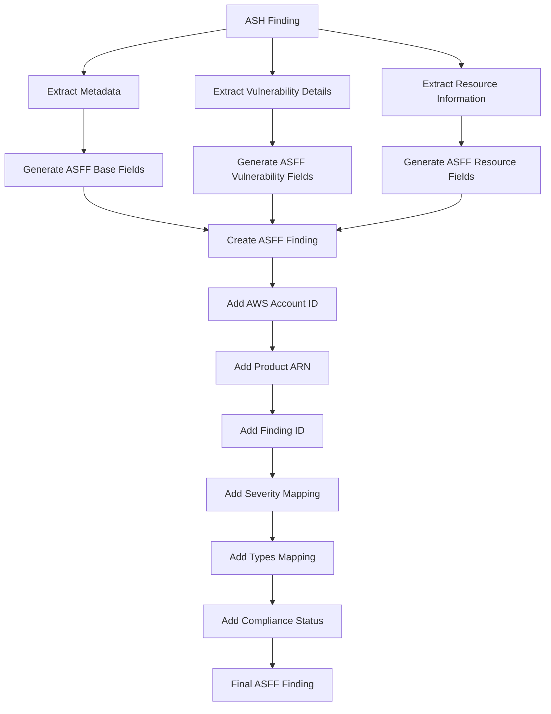
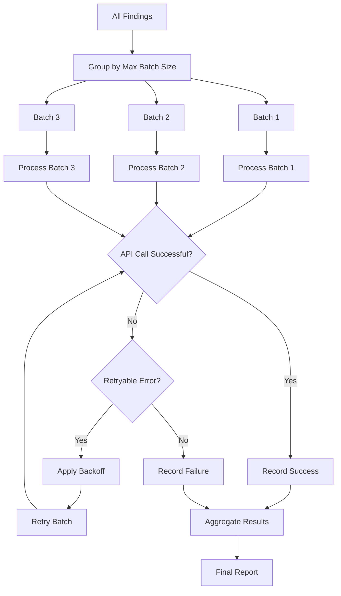
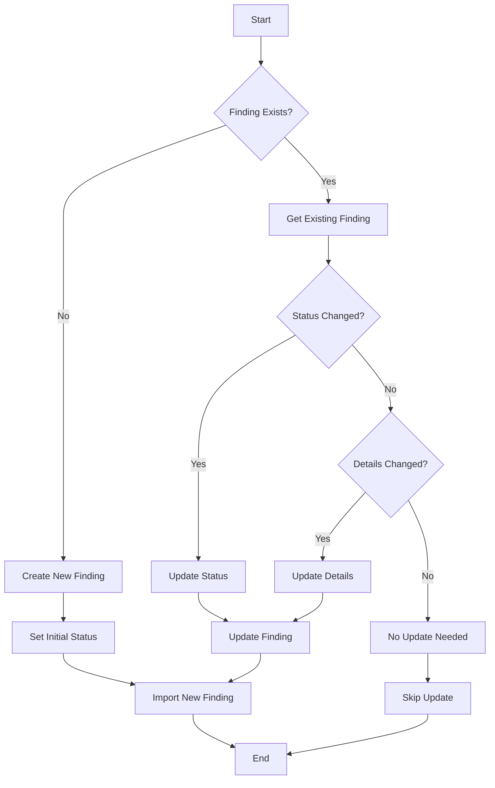
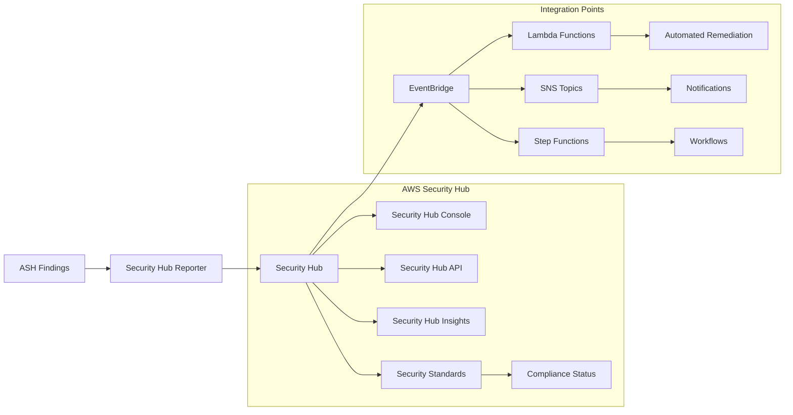
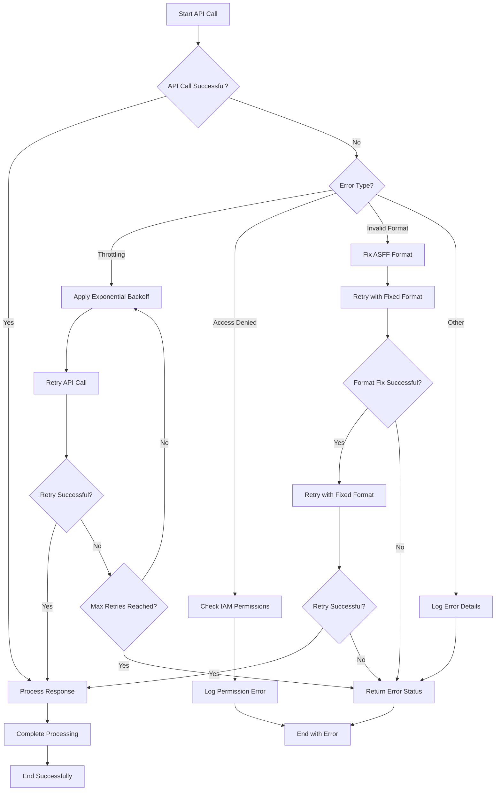
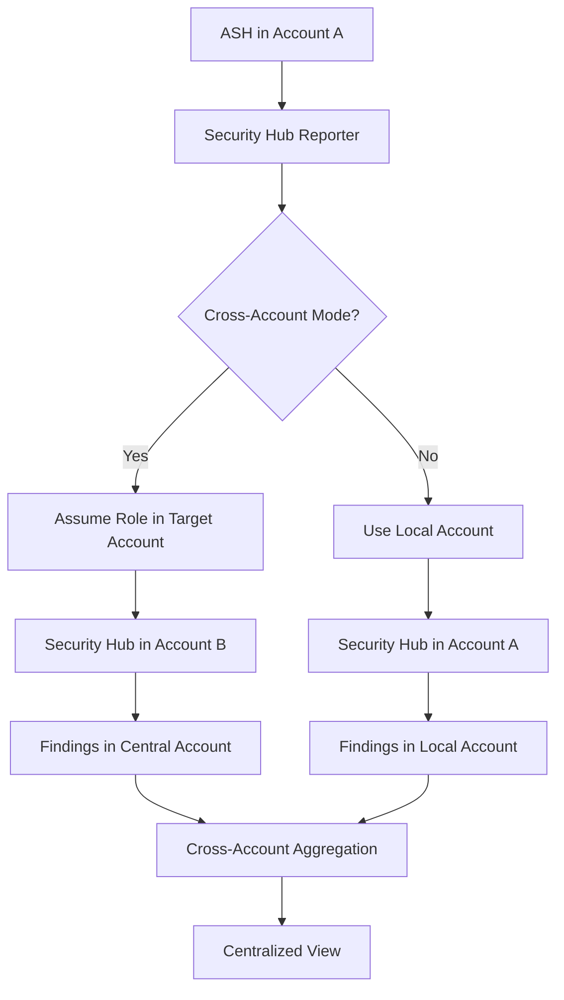
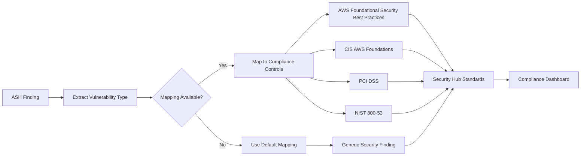
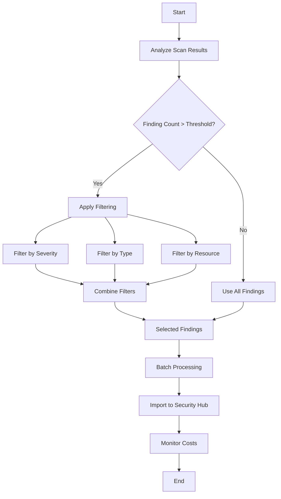

# Security Hub Reporter Diagrams

This document provides visual diagrams of the ASH Security Hub Reporter architecture and workflows using Mermaid.

## Architecture Overview

The following diagram shows the high-level architecture of the Security Hub Reporter:

## Sequence Diagram

The following diagram shows the sequence of operations in the Security Hub Reporter:

## ASFF Conversion Process

The following diagram shows the ASFF conversion process:

## Batch Processing Flow

The following diagram shows the batch processing flow:

## Finding Lifecycle Management

The following diagram shows the finding lifecycle management process:

## Integration with Security Hub

The following diagram shows the integration with AWS Security Hub:

## Error Handling Flow

The following diagram shows the error handling flow with retry logic:

## Cross-Account Integration

The following diagram shows the cross-account integration flow:

## Compliance Framework Mapping

The following diagram shows the compliance framework mapping:

## Cost Optimization Strategy

The following diagram shows the cost optimization strategy:

