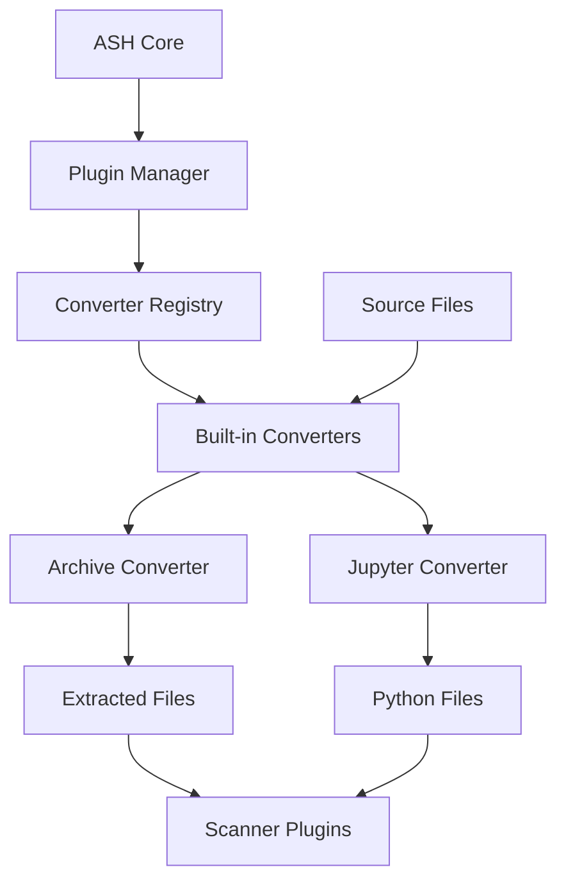
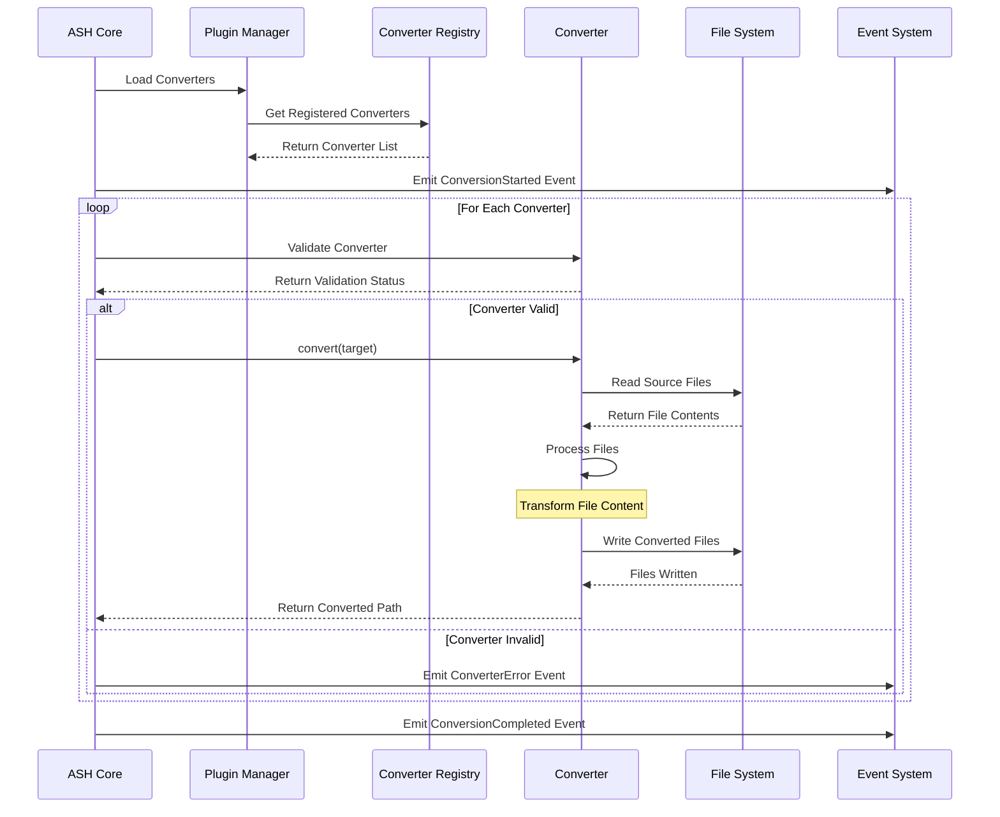
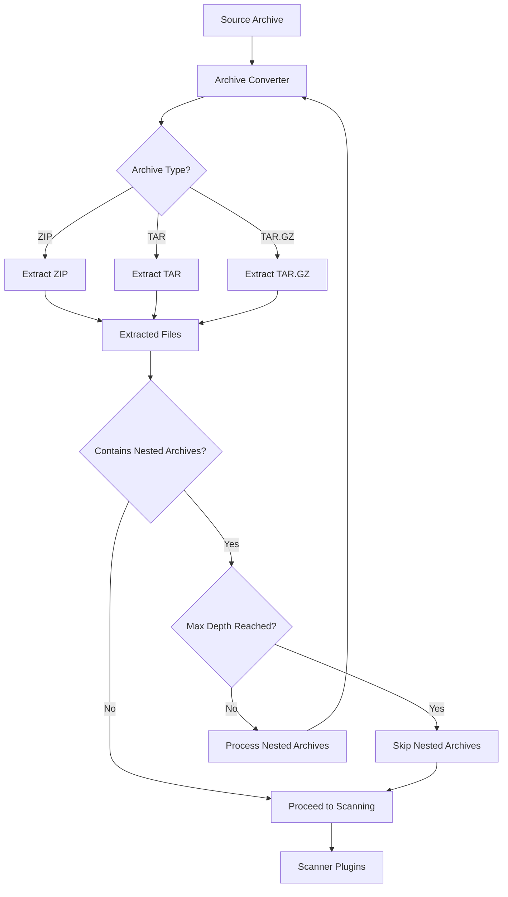
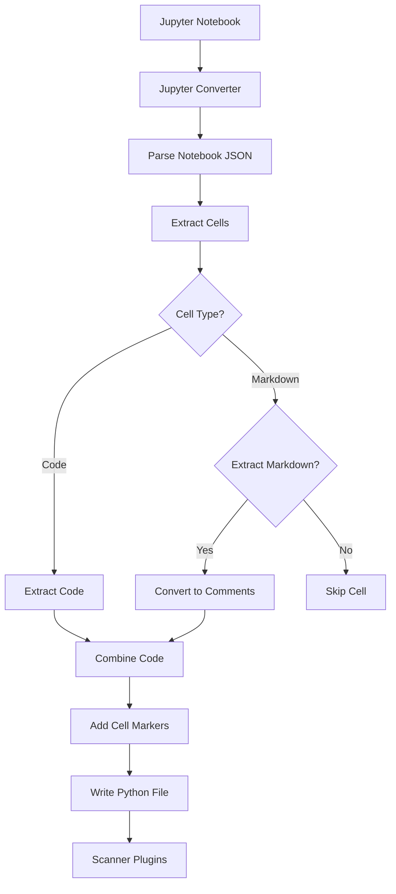
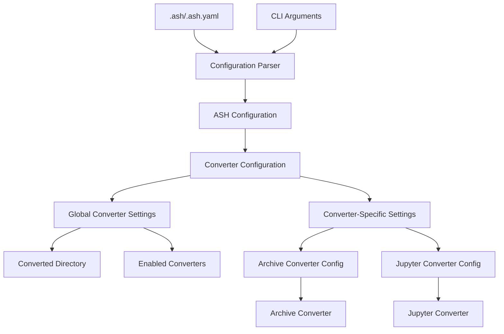
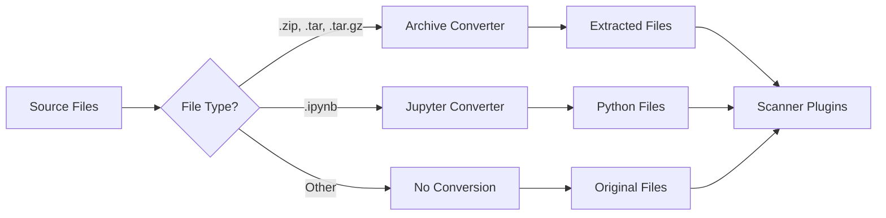
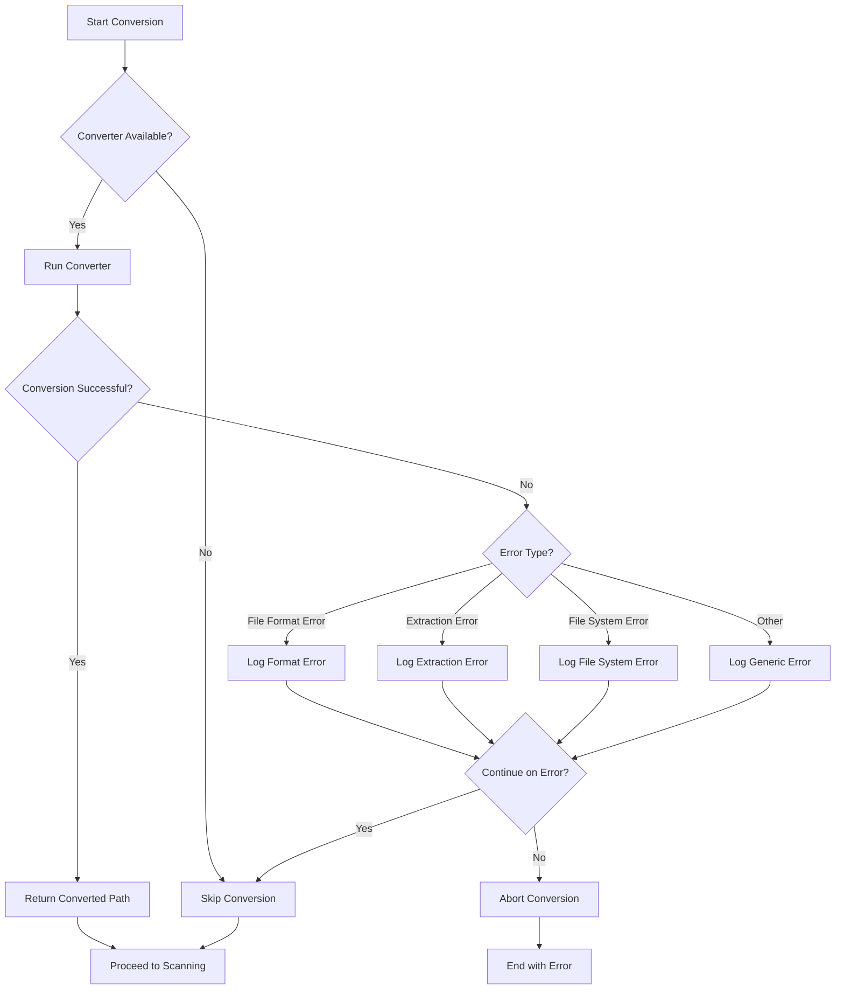
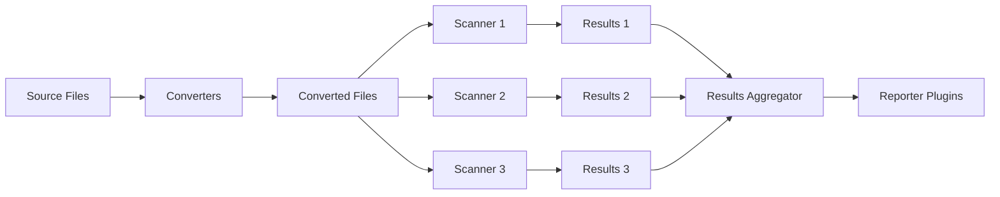

# Built-in Converter Diagrams

This document provides visual diagrams of the ASH built-in converter architecture and workflows using Mermaid.

## Converter Architecture Overview

The following diagram shows the high-level architecture of the ASH built-in converters:

## Converter Execution Flow

The following diagram shows the execution flow of the built-in converters:

## Archive Converter Workflow

The following diagram shows the workflow of the Archive Converter:

## Jupyter Converter Workflow

The following diagram shows the workflow of the Jupyter Converter:

## Converter Configuration Flow

The following diagram shows how configuration flows through the built-in converters:

## File Type Processing

The following diagram shows how different file types are processed by converters:

## Converter Error Handling

The following diagram shows the error handling flow in converters:

## Converter Integration with Scanners

The following diagram shows how converters integrate with scanners:

