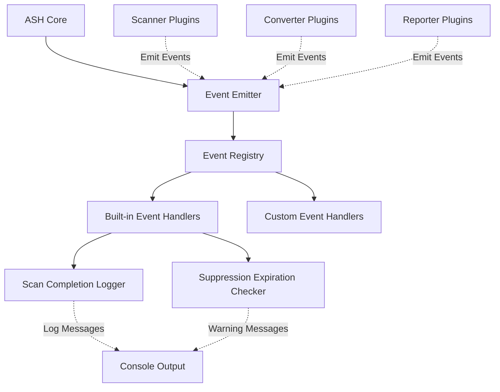
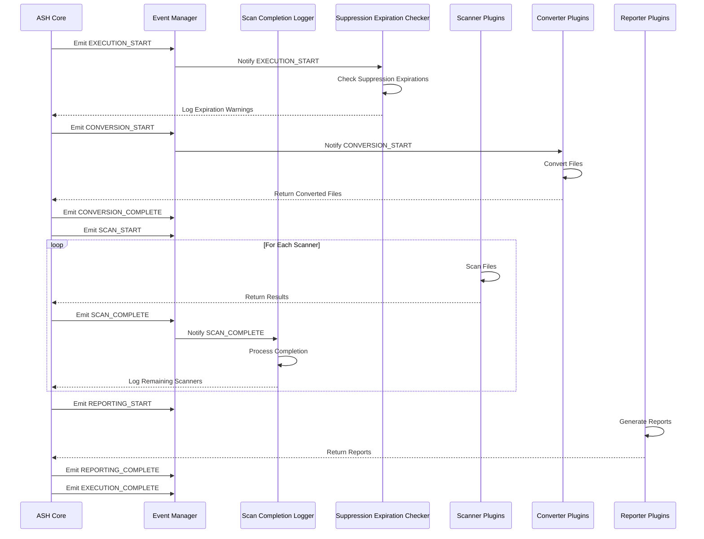
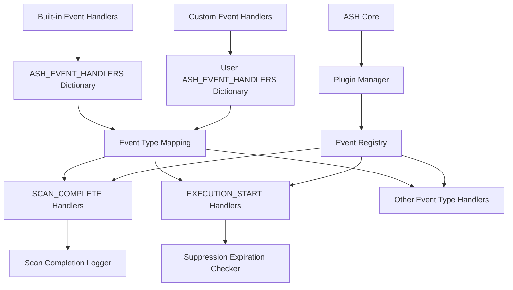
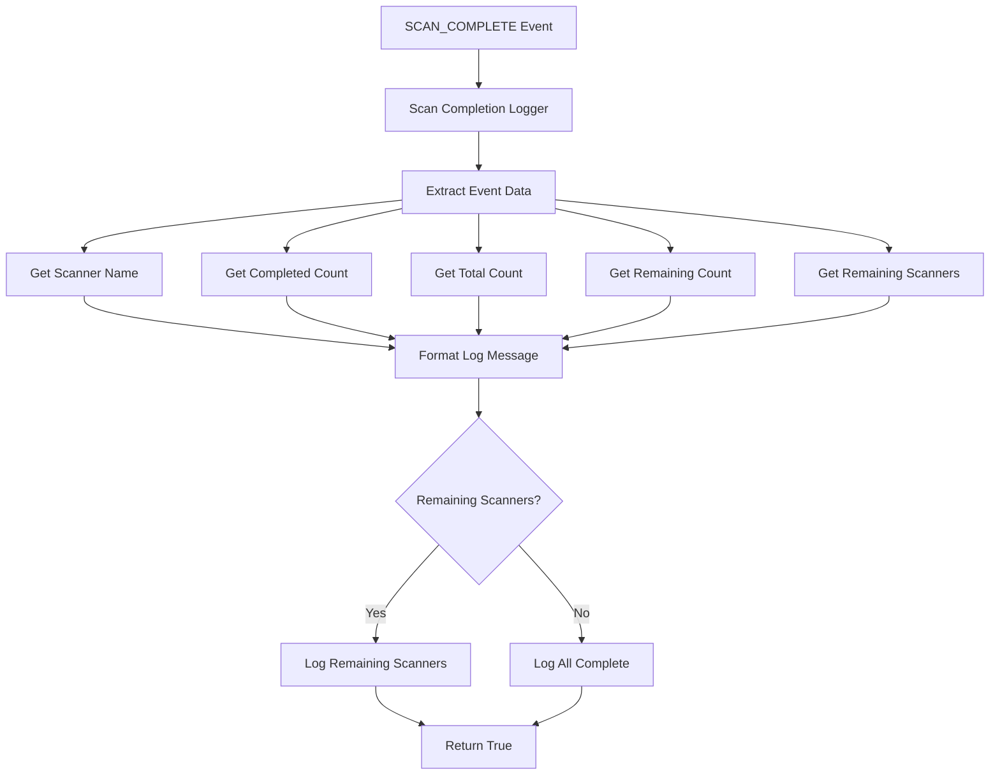
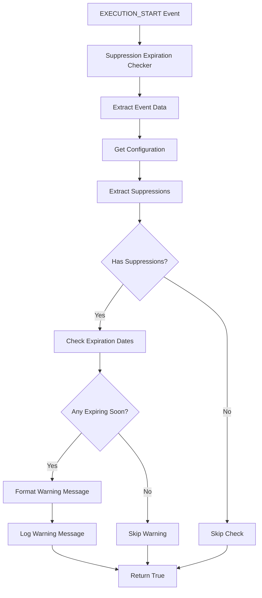
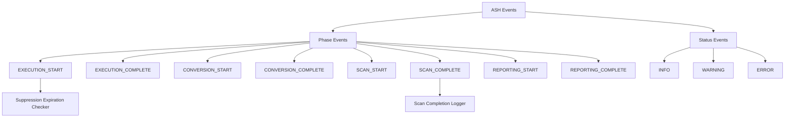
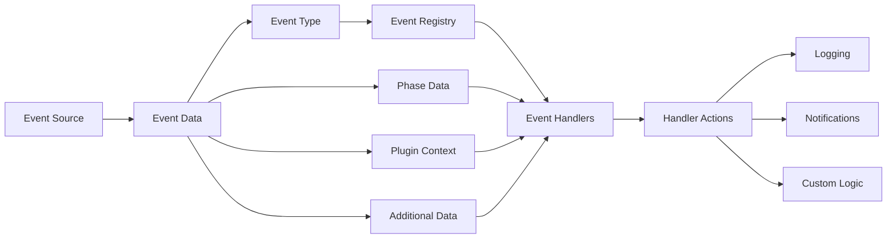
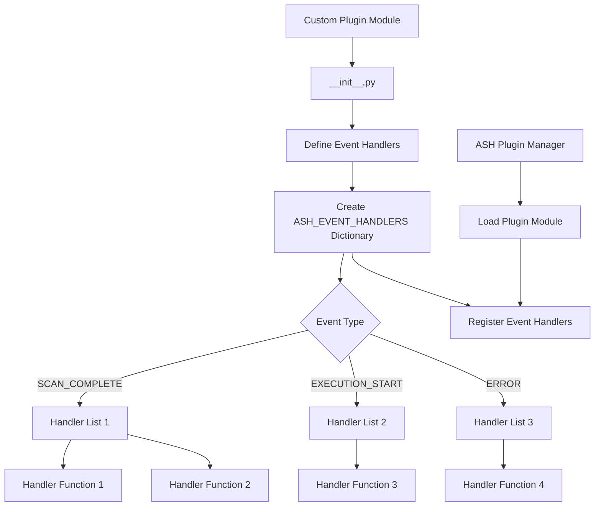

# Built-in Event Handler Diagrams

This document provides visual diagrams of the ASH built-in event handler architecture and workflows using Mermaid.

## Event System Architecture

The following diagram shows the high-level architecture of the ASH event system:

## Event Flow Sequence

The following diagram shows the sequence of events during an ASH scan:

## Event Handler Registration

The following diagram shows how event handlers are registered:

## Scan Completion Logger Flow

The following diagram shows the flow of the Scan Completion Logger:

## Suppression Expiration Checker Flow

The following diagram shows the flow of the Suppression Expiration Checker:

## Event Type Hierarchy

The following diagram shows the hierarchy of event types:

## Event Data Flow

The following diagram shows the data flow through the event system:

## Custom Event Handler Integration

The following diagram shows how custom event handlers can be integrated:

