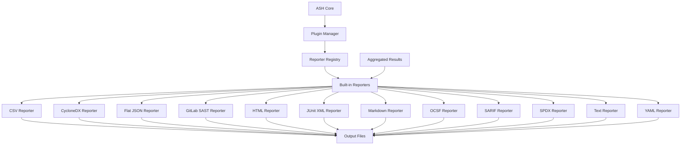
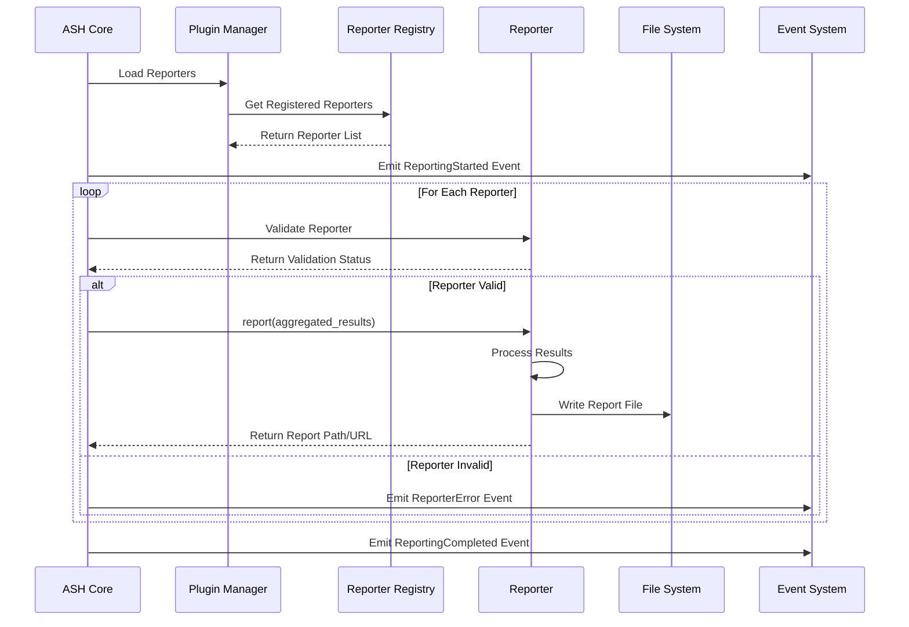
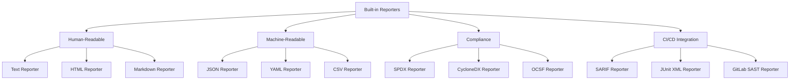
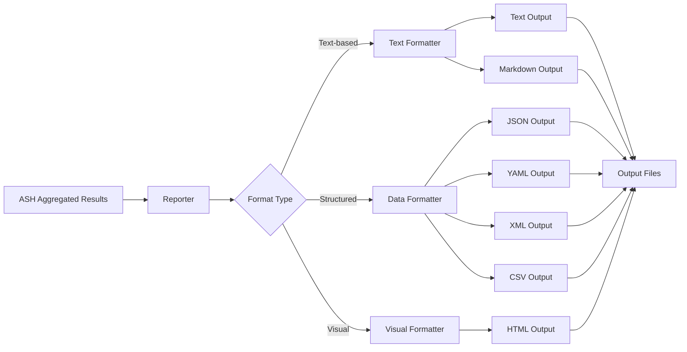
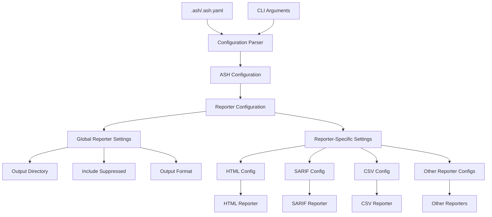
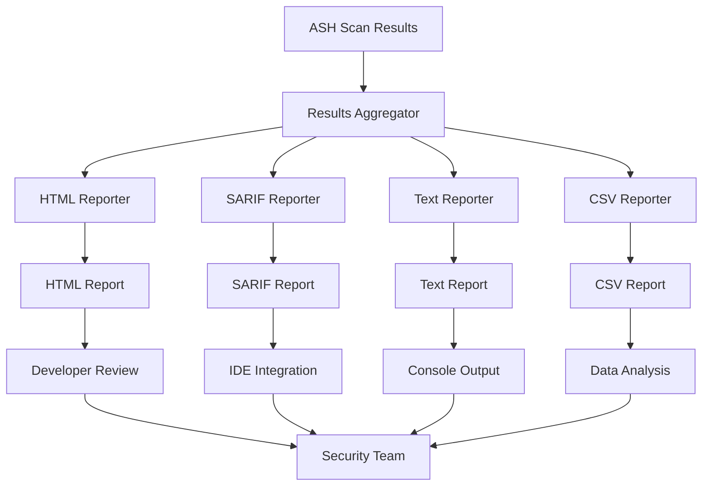
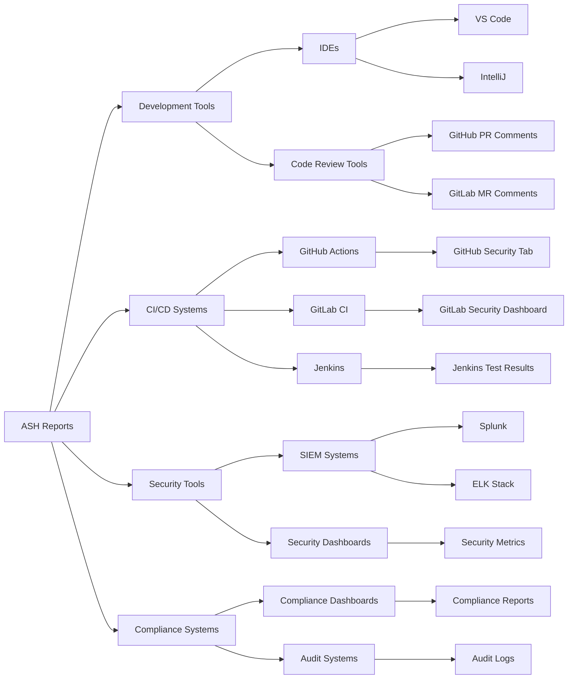
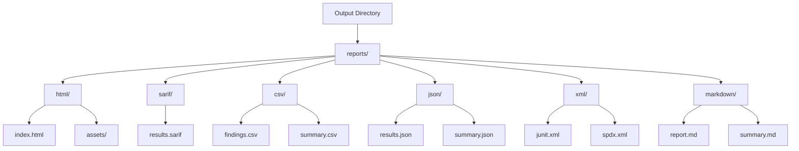
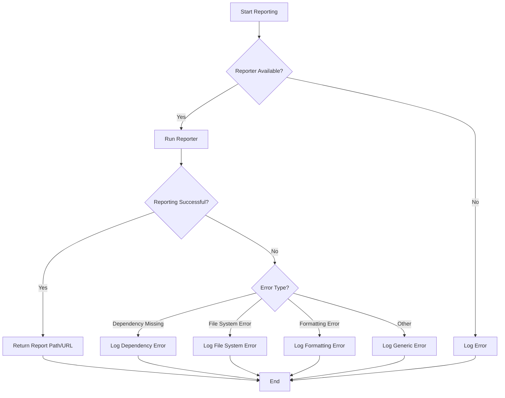

# Built-in Reporter Diagrams

This document provides visual diagrams of the ASH built-in reporter architecture and workflows using Mermaid.

## Reporter Architecture Overview

The following diagram shows the high-level architecture of the ASH built-in reporters:

## Reporter Execution Flow

The following diagram shows the execution flow of the built-in reporters:

## Reporter Format Classification

The following diagram shows the classification of built-in reporters by output format:

## Reporter Data Flow

The following diagram shows the data flow through the built-in reporters:

## Reporter Configuration Flow

The following diagram shows how configuration flows through the built-in reporters:

## Multi-Reporter Workflow

The following diagram shows the workflow when multiple reporters are enabled:

## Reporter Integration Points

The following diagram shows the integration points of built-in reporters:

## Reporter Output Organization

The following diagram shows the organization of reporter outputs:

## Reporter Error Handling

The following diagram shows the error handling flow in reporters:

