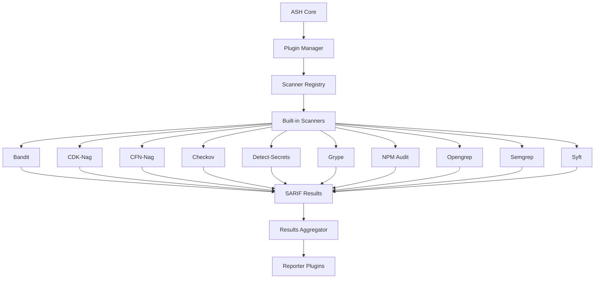
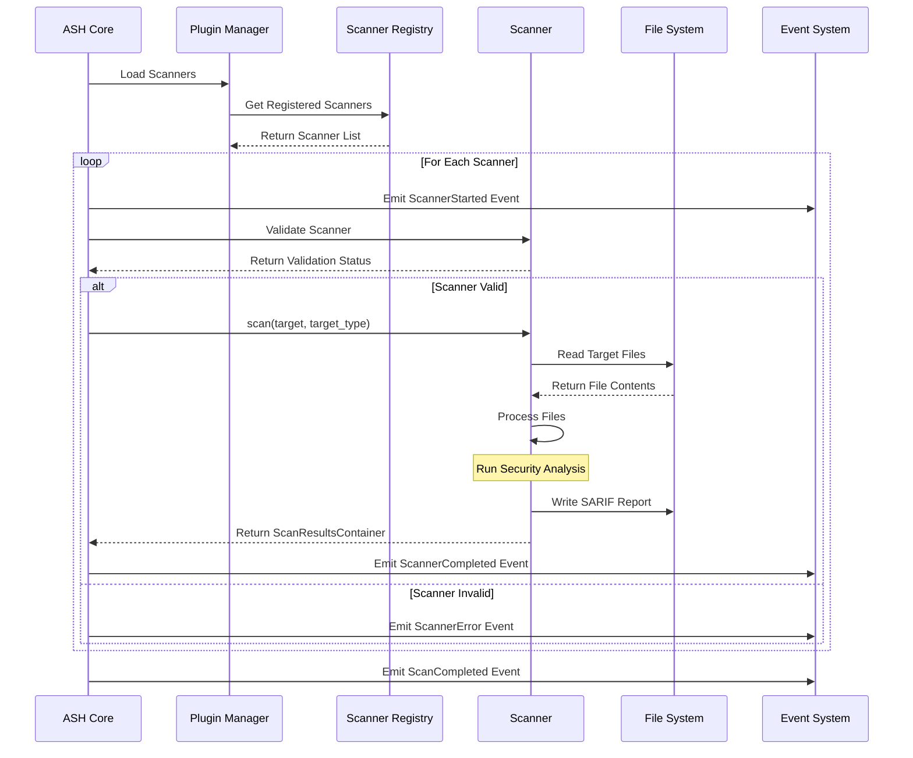
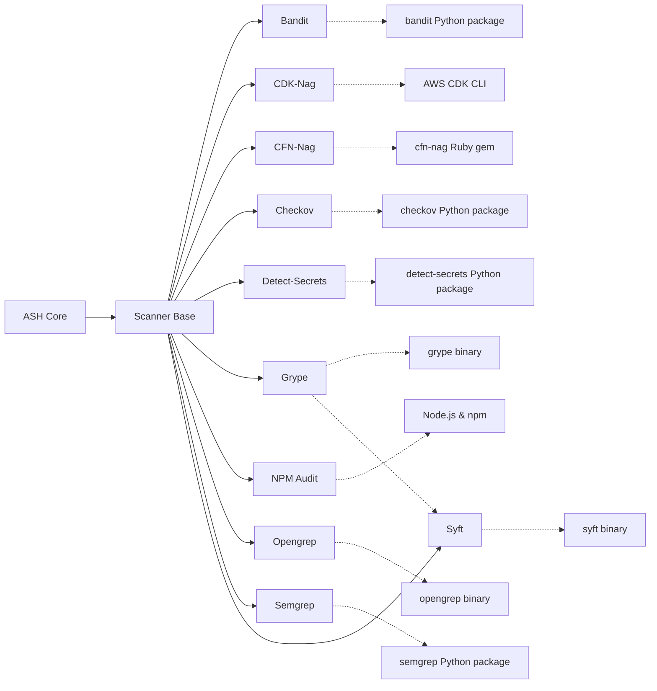
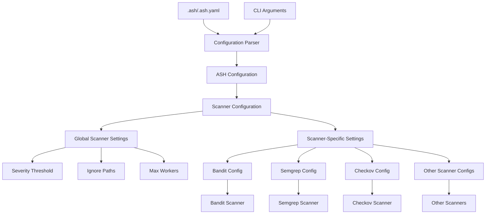
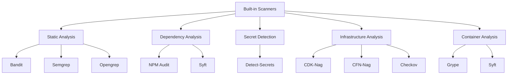
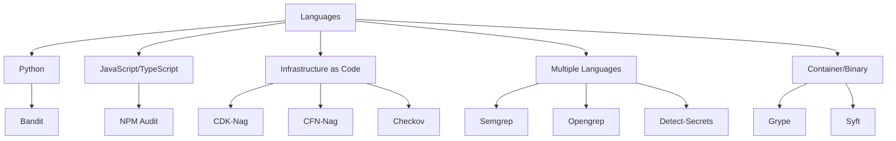
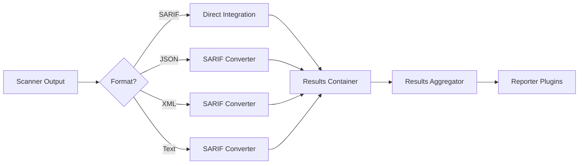
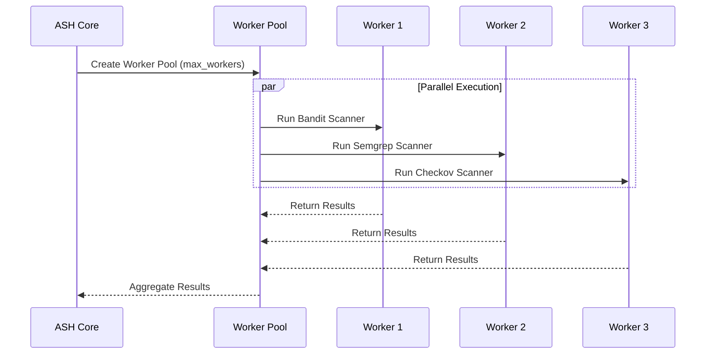
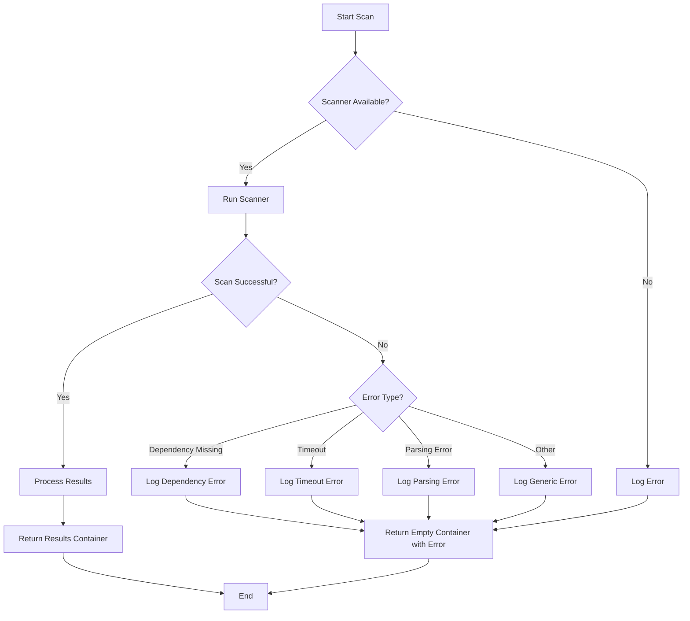

# Built-in Scanner Diagrams

This document provides visual diagrams of the ASH built-in scanner architecture and workflows using Mermaid.

## Scanner Architecture Overview

The following diagram shows the high-level architecture of the ASH built-in scanners:

## Scanner Execution Flow

The following diagram shows the execution flow of the built-in scanners:

## Scanner Dependency Graph

The following diagram shows the dependency relationships between the built-in scanners:

## Scanner Configuration Flow

The following diagram shows how configuration flows through the built-in scanners:

## Scanner Type Classification

The following diagram shows the classification of built-in scanners by type:

## Scanner Language Support

The following diagram shows the language support of built-in scanners:

## Scanner Result Processing

The following diagram shows how scanner results are processed:

## Scanner Parallel Execution

The following diagram shows the parallel execution of scanners:

## Scanner Error Handling

The following diagram shows the error handling flow in scanners:

