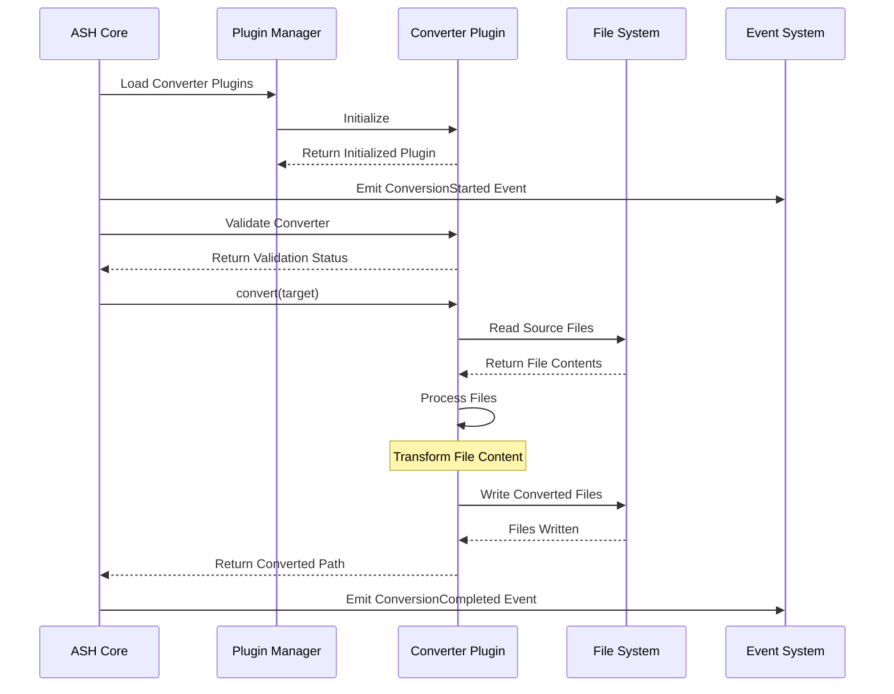
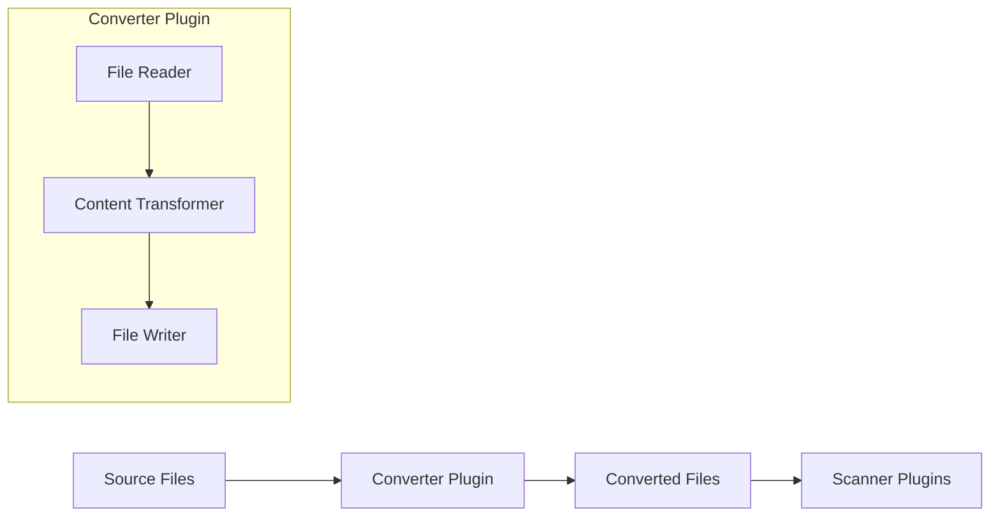
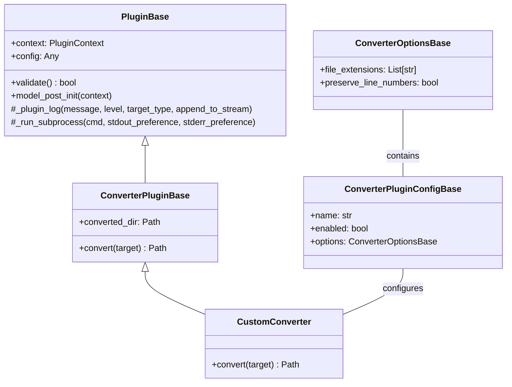
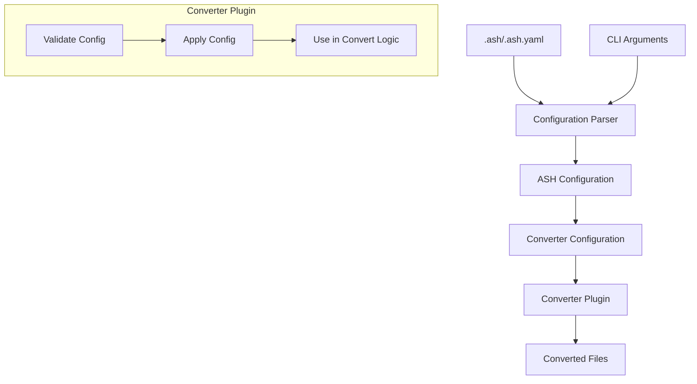
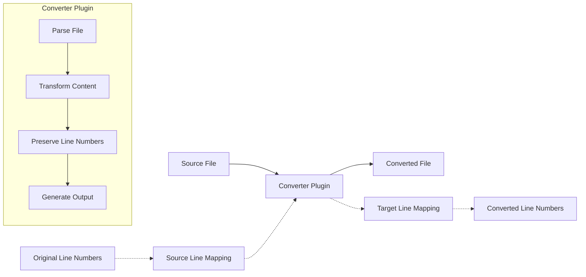
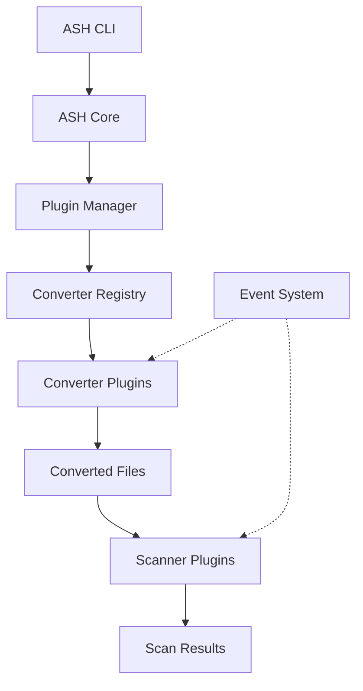

# Converter Plugin Diagrams

This document provides visual diagrams of the ASH converter plugin architecture using Mermaid.

## Converter Plugin Lifecycle

The following diagram shows the lifecycle of a converter plugin during an ASH scan:

## Converter Plugin Data Flow

The following diagram shows the data flow through a converter plugin:

## Converter Plugin Class Hierarchy

The following diagram shows the class hierarchy for converter plugins:

## Converter Plugin Configuration Flow

The following diagram shows how configuration flows through a converter plugin:

## File Transformation Process

The following diagram shows the file transformation process in a converter plugin:

## Converter Integration with ASH Core

The following diagram shows how converter plugins integrate with the ASH core:

