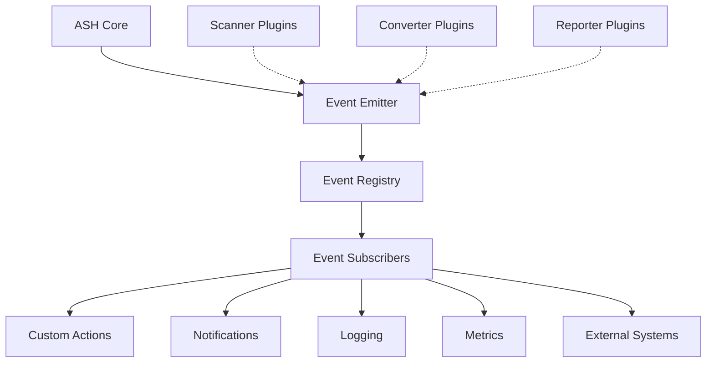
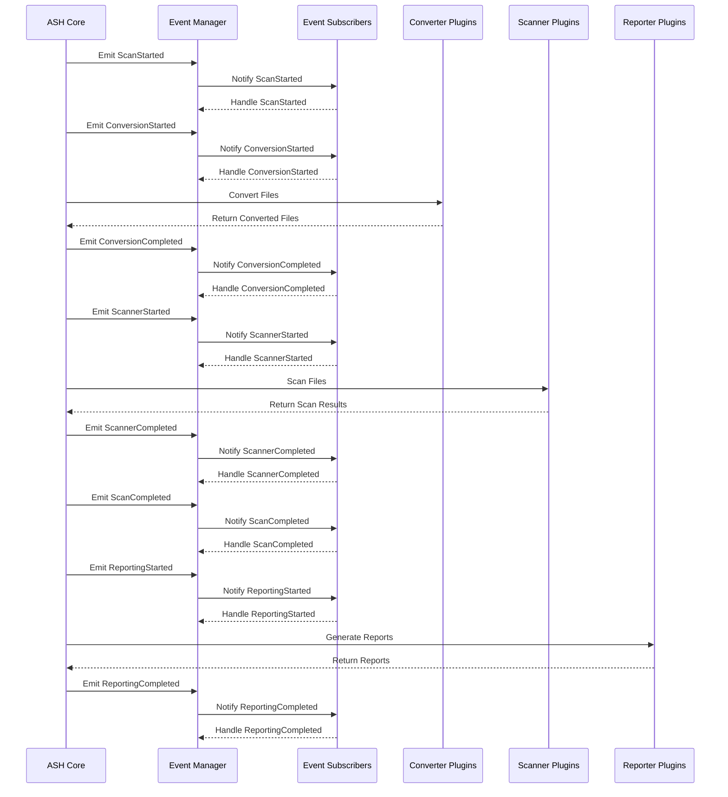
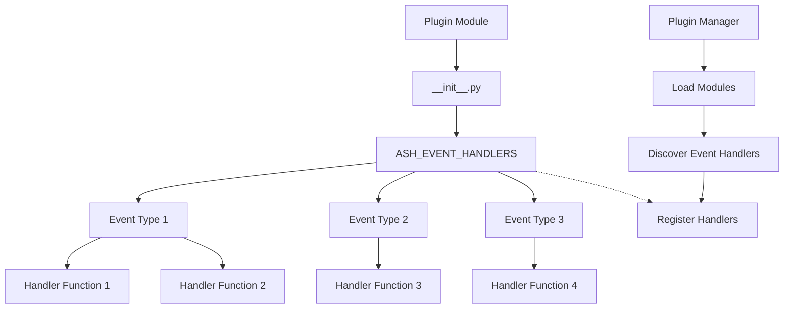
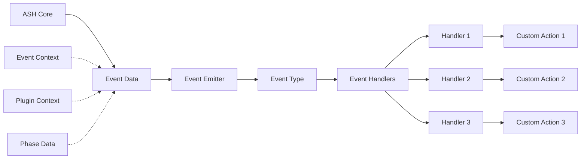
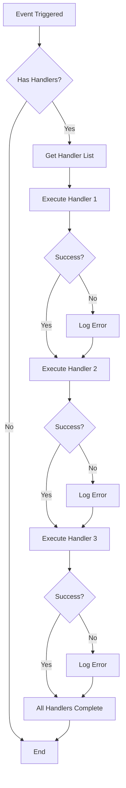
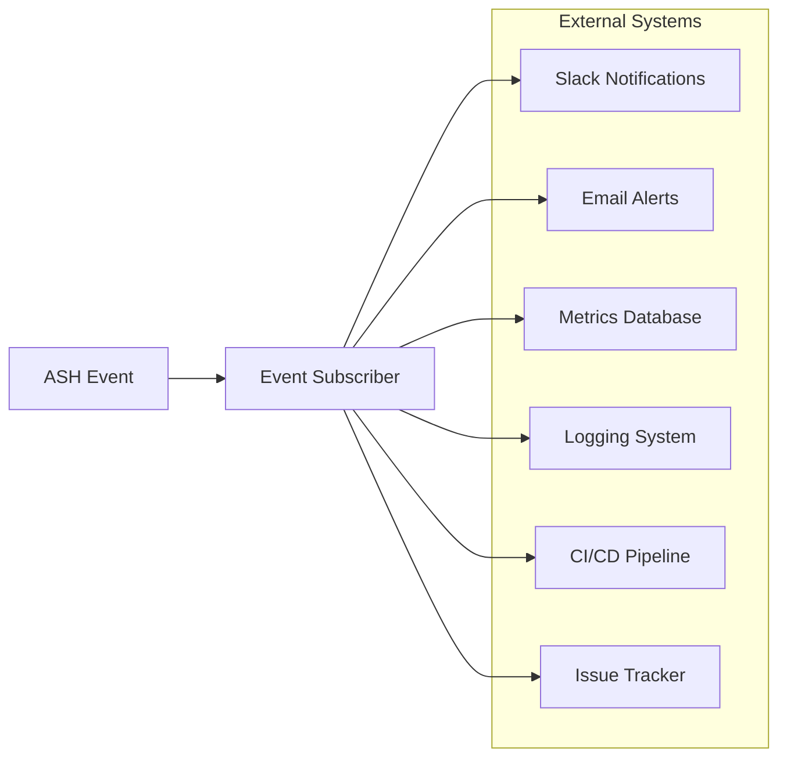

# Event Subscriber Diagrams

This document provides visual diagrams of the ASH event system architecture using Mermaid.

## Event System Overview

The following diagram shows the high-level architecture of the ASH event system:

## Event Flow Sequence

The following diagram shows the sequence of events during an ASH scan:

## Event Subscriber Registration

The following diagram shows how event subscribers are registered:

## Event Data Flow

The following diagram shows the data flow through the event system:

## Event Handler Execution

The following diagram shows the execution flow of event handlers:

## Integration with External Systems

The following diagram shows how event subscribers can integrate with external systems:

