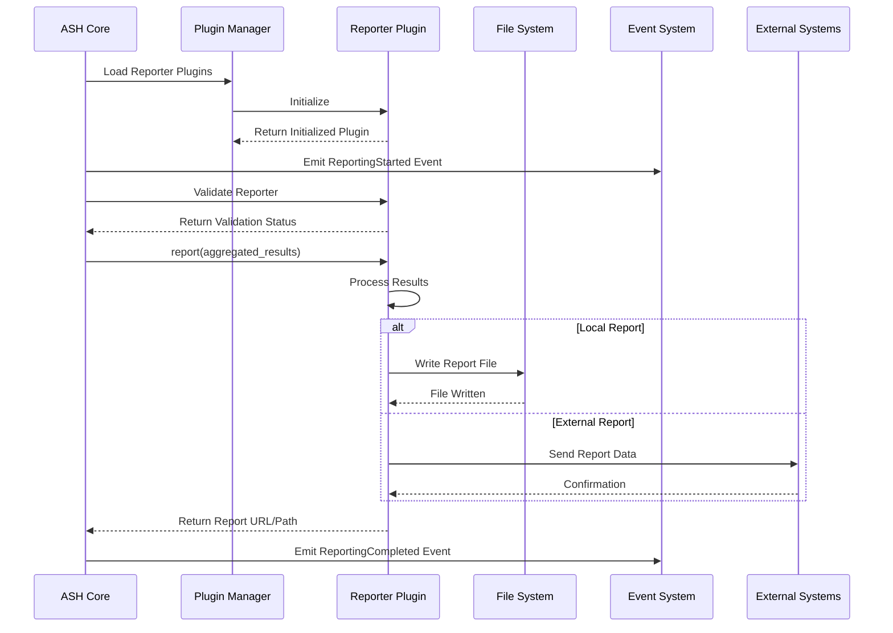
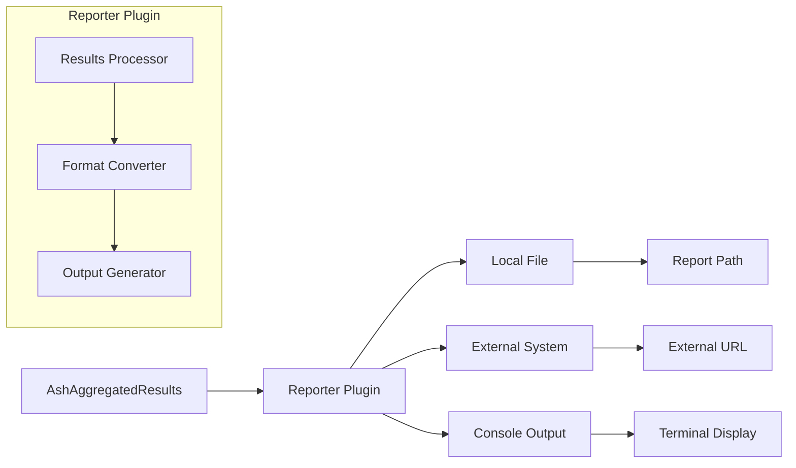
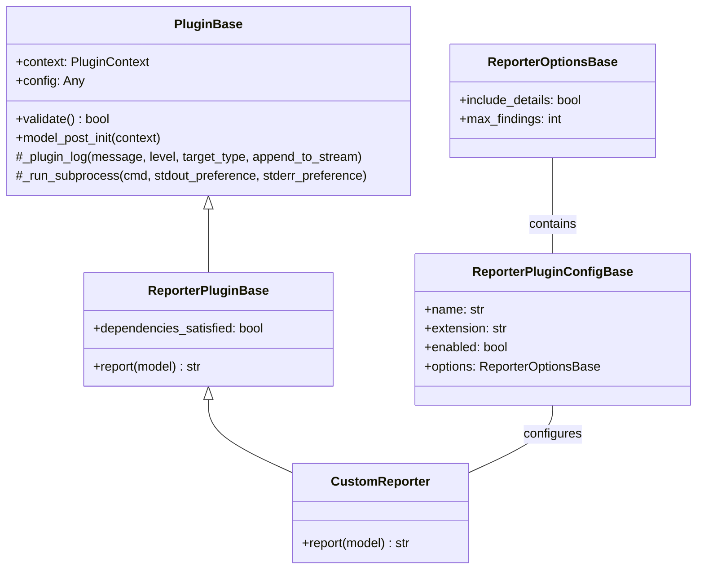
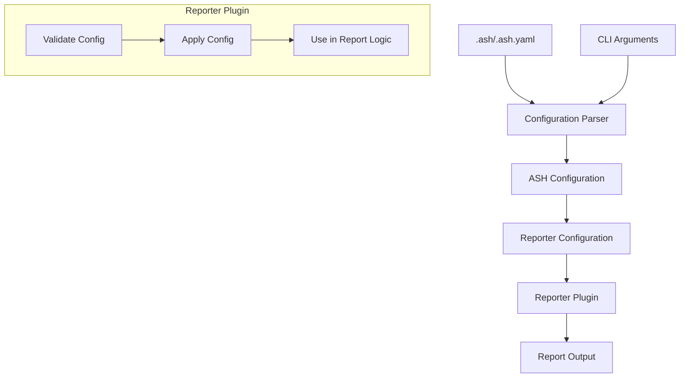
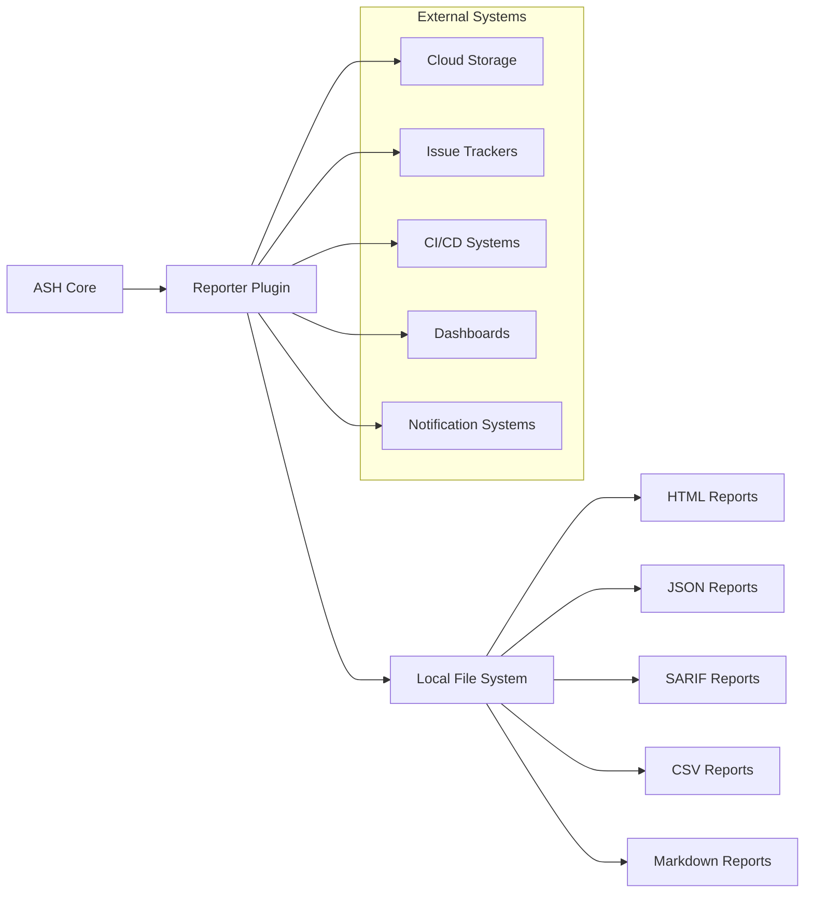

# Reporter Plugin Diagrams

This document provides visual diagrams of the ASH reporter plugin architecture using Mermaid.

## Reporter Plugin Lifecycle

The following diagram shows the lifecycle of a reporter plugin during an ASH scan:

## Reporter Plugin Data Flow

The following diagram shows the data flow through a reporter plugin:

## Reporter Plugin Class Hierarchy

The following diagram shows the class hierarchy for reporter plugins:

## Reporter Plugin Configuration Flow

The following diagram shows how configuration flows through a reporter plugin:

## Reporter Integration with External Systems

The following diagram shows how reporter plugins can integrate with external systems:

