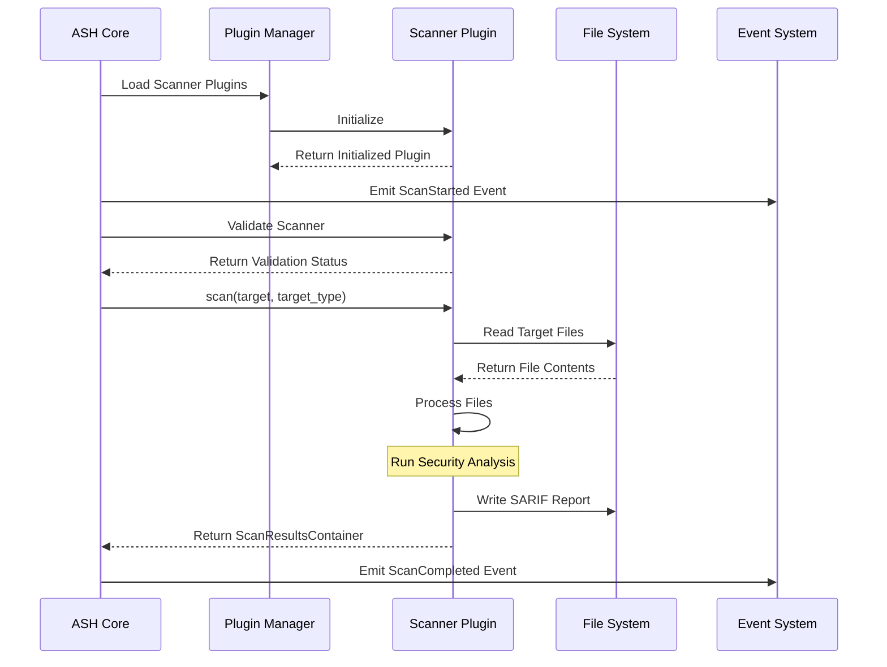
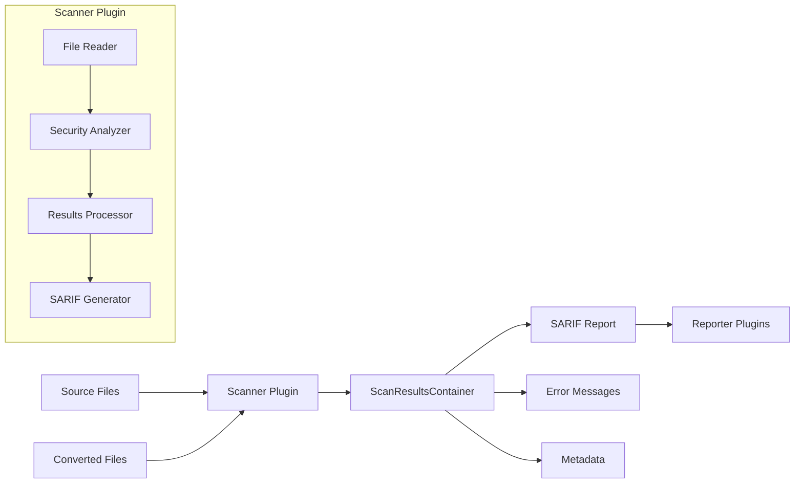
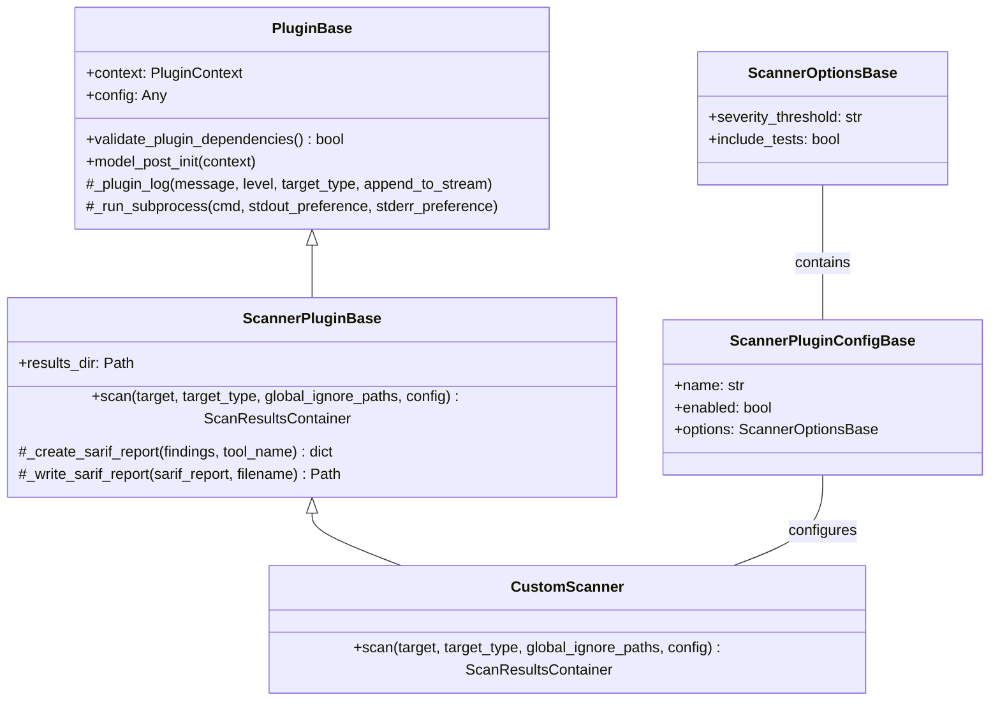
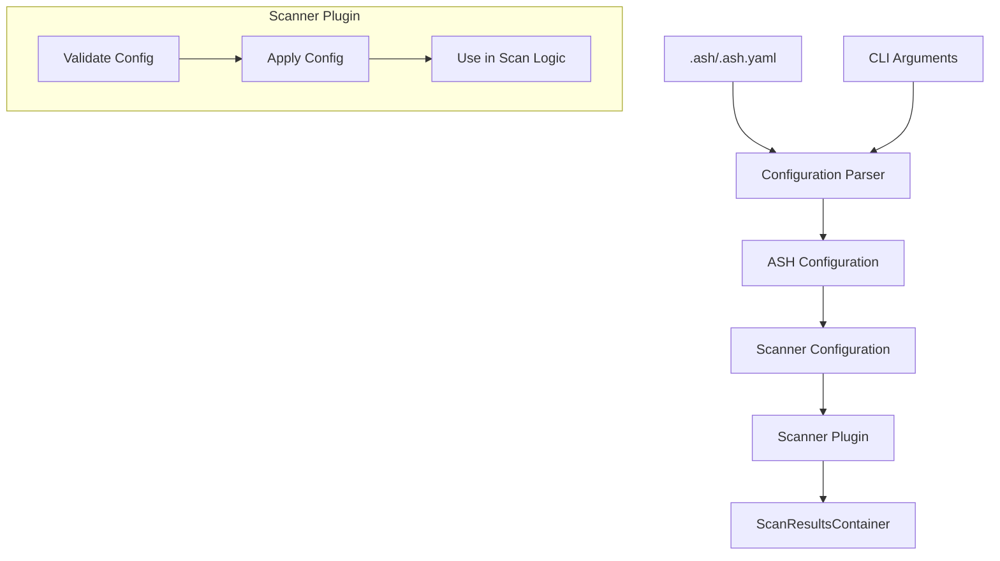
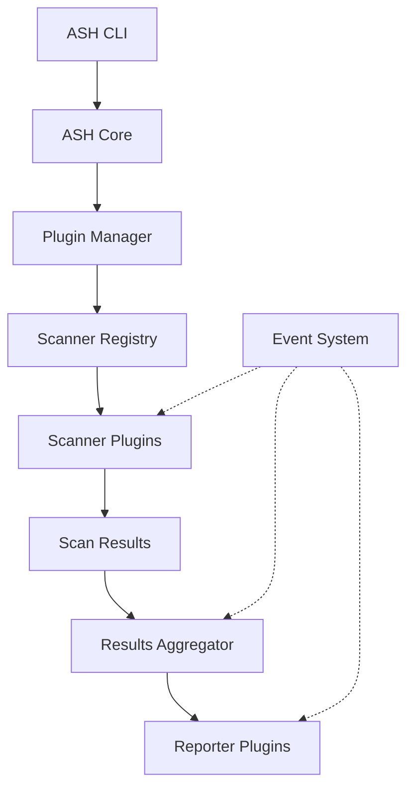

# Scanner Plugin Diagrams

This document provides visual diagrams of the ASH scanner plugin architecture using Mermaid.

## Scanner Plugin Lifecycle

The following diagram shows the lifecycle of a scanner plugin during an ASH scan:

## Scanner Plugin Data Flow

The following diagram shows the data flow through a scanner plugin:

## Scanner Plugin Class Hierarchy

The following diagram shows the class hierarchy for scanner plugins:

## Scanner Plugin Configuration Flow

The following diagram shows how configuration flows through a scanner plugin:

## Scanner Integration with ASH Core

The following diagram shows how scanner plugins integrate with the ASH core:

