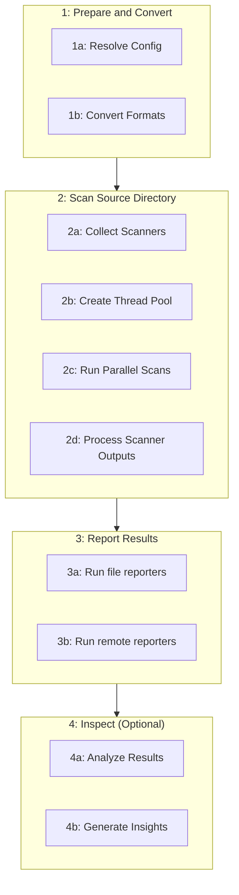

# ASH Orchestrator Workflow

- [Phase Overview](#phase-overview)
  - [1. Prepare and Convert](#1-prepare-and-convert)
  - [2. Scan Source Directory](#2-scan-source-directory)
  - [3. Report Results](#3-report-results)
  - [4. Inspect (Optional)](#4-inspect-optional)
- [Deep Dive](#deep-dive)
  - [`ASHScanOrchestrator`](#ashscanorchestrator)
  - [`ScanExecutionEngine`](#scanexecutionengine)
  - [`ScannerFactory`](#scannerfactory)

## Phase Overview

ASH security scan orchestration is comprised of 3 main phases (with an optional 4th phase) focused on specific tasks across each phase.



### 1. Prepare and Convert

1. Resolve configuration
2. Convert any unscannable formats into scannable ones
    - Jupyter notebooks to Python
    - Zip/Tar/etc archive content extraction

### 2. Scan Source Directory

1. Collect the set of scanners and scan paths based on the build-time default configuration merged with the user's configuration (if present)
2. Create a thread pool, registering each scanner instance into it
3. Invoke threads in parallel to start scanners
4. Process scanner outputs as they complete
   - Vulnerability/SAST scanner outputs are parsed into SARIF format, if not already
   - SBOM scanner outputs are parsed into CycloneDX format, if not already

### 3. Report Results

1. File-based reporters such as Text, HTML, JUnitXML, JSON, SARIF, etc
2. Remote reporters such as Amazon Security Hub or custom API endpoints

### 4. Inspect (Optional)

1. Analyze results for patterns and insights
2. Generate additional context and recommendations
3. Evaluate SARIF field propagation across scanner outputs
   - Compare fields used by different scanners
   - Identify fields missing from aggregate reports
   - Generate field mapping reports and statistics

The `ash inspect sarif-fields` command provides detailed analysis of SARIF fields across scanner outputs, helping identify inconsistencies in field usage and ensuring proper data propagation to aggregate reports.

## Deep Dive

### `ASHScanOrchestrator`

Whether invoking via CLI script or from Python directly, the ASH scan entrypoint involves instantiating an `ASHScanOrchestrator` instance.

Sample from Python:

```py
orchestrator = ASHScanOrchestrator(
    source_dir=Path(source_dir),
    output_dir=Path(output_dir),
    config_path=Path("ash.yaml"),
    scan_output_formats=[
        ExportFormat.JSON,
        ExportFormat.SARIF,
        ExportFormat.CYCLONEDX
        ExportFormat.HTML,
        ExportFormat.JUNITXML,
    ],
)
```

Same sample as CLI:

```sh
ash --source-dir "." --output-dir "./ash_output" --config-path "./ash.yaml" --scan-output-formats json,sarif,cyclonedx,html,junitxml
```


### `ScanExecutionEngine`

The `ScanExecutionEngine` is responsible for orchestrating the execution of the scan workflow. It manages the core phases of the ASH workflow:

1. Preparing and converting source files
2. Running scanners in parallel
3. Processing and reporting results

The execution engine handles thread management, scanner coordination, and ensures proper execution of the workflow phases.

### `ScannerFactory`

The `ScannerFactory` is responsible for creating scanner instances based on configuration. It:

1. Determines which scanners should run based on file types and configuration
2. Instantiates scanner objects with appropriate settings
3. Provides scanner instances to the execution engine

This factory pattern allows for dynamic scanner selection and configuration based on th
